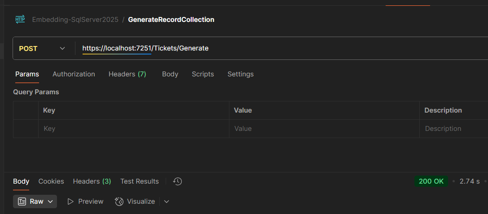

# AI-Powered Customer Support Ticket Search with .NET and SQL Server 2025

This project demonstrates how to build a semantic search system for customer support tickets using **embeddings** and **vector search**. It combines the power of:
- **.NET 9** Web API
- **SQL Server 2025** with vector search capabilities
- **Ollama** for local AI embeddings
- **Semantic Kernel** for AI integration

## What are Embeddings and Vector Search?

**Embeddings** are numerical representations of text that capture semantic meaning. Similar texts have similar embeddings, enabling "smart" search that understands context rather than just matching keywords.

**Vector Search** finds the most similar items by comparing these numerical representations, allowing you to search for "login issues" and find tickets about "can't access account" even without exact keyword matches.

## Project Structure

```
AI.SQLServerEmbeddingsApp/
├── WebApi/
│   ├── Models/
│   │   └── CustomerSupportTicket.cs    # Data model with vector attributes
│   ├── Endpoints/
│   │   └── ApiEndpoints.cs             # API endpoints for generate/search
│   ├── Appsettings/
│   │   └── AISettings.cs               # Configuration for AI services
│   └── Program.cs                      # Application startup
├── Docker-compose.yml                  # SQL Server & Ollama containers
└── README.md
```

## Prerequisites

- [.NET 9 SDK](https://dotnet.microsoft.com/download/dotnet/9.0)
- [Docker Desktop](https://www.docker.com/products/docker-desktop/)
- Basic understanding of REST APIs

## Quick Start

### 1. Start Infrastructure Services

Run SQL Server 2025 and Ollama using Docker:

```bash
docker-compose up -d
```

This starts:
- **SQL Server 2025** on port `1500` (username: `sa`, password: `MyStrongPassword123!`)
- **Ollama** on port `11434`


### 2. Download the Embedding Model

Pull the embedding model used by the application:

```bash
docker exec -it ollama ollama pull nomic-embed-text
```

### 3. Run the Application

```bash
cd WebApi
dotnet run
```

The API will be available at `https://localhost:7071` or `http://localhost:5071`

## API Endpoints

### Generate Sample Data
**POST** `/Tickets/Generate`

Generates sample customer support tickets, creates embeddings for each ticket description, and stores them in SQL Server.

```bash
curl -X POST https://localhost:7071/Tickets/Generate
```



**What happens:**
1. Creates sample ticket data
2. Sends ticket descriptions to Ollama for embedding generation
3. Stores tickets with embeddings in SQL Server


### Search Tickets
**GET** `/Tickets/Search?query={your-search-query}`

Performs semantic search to find similar tickets based on the query.

```bash
curl "https://localhost:7071/Tickets/Search?query=password reset"
```


**What happens:**
1. Converts your search query into an embedding
2. Compares it with stored ticket embeddings using cosine similarity
3. Returns the most relevant tickets

## Configuration

### appsettings.json

```json
{
  "ConnectionStrings": {
    "DefaultConnection": "Server=localhost,1500;Database=CustomerSupportTickets;User Id=sa;Password=MyStrongPassword123!;TrustServerCertificate=true;"
  },
  "AISettings": {
    "EmbeddingModel": "nomic-embed-text",
    "OllamaEndpoint": "http://localhost:11434",
    "ChatModel": "llava"
  }
}
```

## Key Technologies

### Microsoft Semantic Kernel
Provides AI integration capabilities and vector store connectors.

### SQL Server 2025 Vector Search
Native vector storage and similarity search using cosine distance.

### Ollama
Local AI model serving for embedding generation without external API dependencies.

## Data Model

The `CustomerSupportTicket` record includes:

```csharp
public record CustomerSupportTicket
{
    [VectorStoreKey]
    public string TicketId { get; set; }
    
    [VectorStoreData]
    public string IssueDescription { get; set; }
    
    [VectorStoreVector(Dimensions: 768, DistanceFunction = DistanceFunction.CosineDistance)]
    public ReadOnlyMemory<float>? Embedding { get; set; }
    
    // ... other properties
}
```

## Troubleshooting

### Common Issues

1. **Docker containers not starting**: Ensure Docker Desktop is running
2. **Connection refused to Ollama**: Wait for Ollama container to fully start
3. **SQL Server connection issues**: Verify the connection string and that SQL Server container is healthy
4. **Model not found**: Run `docker exec -it ollama ollama pull nomic-embed-text`

### Logs

Check application logs for detailed error information. SQL Server query logging is enabled in development.

## Next Steps

- Add more sophisticated ticket data
- Implement user authentication
- Add real-time search suggestions
- Deploy to cloud with Azure SQL Database
- Integrate with actual ticketing systems

## Learn More

- [Semantic Kernel Documentation](https://learn.microsoft.com/en-us/semantic-kernel/)
- [SQL Server Vector Search](https://learn.microsoft.com/en-us/sql/relational-databases/vectors/)
- [Ollama Models](https://ollama.ai/library)
- [.NET 9 Documentation](https://learn.microsoft.com/en-us/dotnet/)