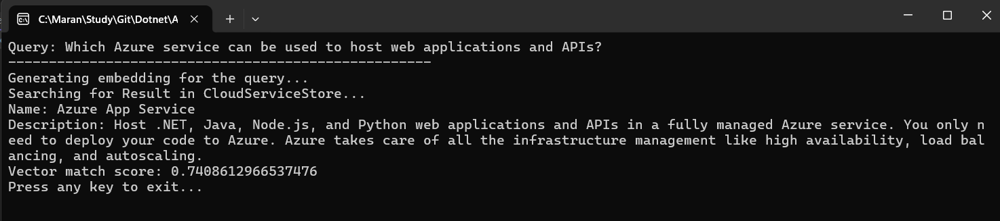
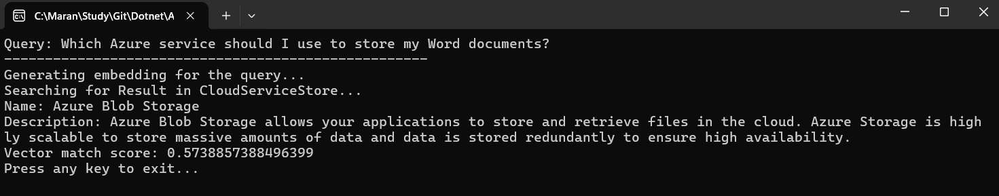
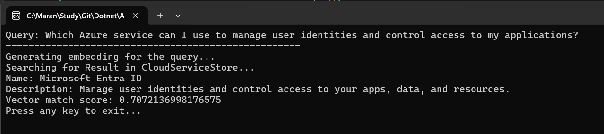

# AI Vector Search Demo

A .NET 9 console application demonstrating vector search capabilities using OpenAI embeddings and Microsoft Extensions AI framework.

## Overview

This project showcases how to implement semantic search using vector embeddings to find relevant Azure cloud services based on natural language queries.

## Features

- **Vector Embeddings**: Uses OpenAI's `text-embedding-3-small` model to generate embeddings
- **In-Memory Vector Store**: Stores and searches cloud service data using Microsoft Semantic Kernel
- **Semantic Search**: Performs similarity search using cosine distance
- **Configuration Management**: Secure API key storage using .NET User Secrets

## Technologies Used

- .NET 9
- Microsoft Extensions AI
- Microsoft Semantic Kernel
- OpenAI API
- Vector Data Abstractions

## Setup

1. Set your OpenAI API key using User Secrets:
   ```bash
   dotnet user-secrets set "OpenAIKey" "your-api-key-here"
   ```

2. Optionally set a custom model:
   ```bash
   dotnet user-secrets set "ModelName" "text-embedding-3-small"
   ```

3. Run the application:
   ```bash
   dotnet run --project ConsoleApp
   ```

## How It Works

1. **Data Preparation**: Loads Azure cloud services with descriptions
2. **Embedding Generation**: Creates vector embeddings for each service description
3. **Vector Storage**: Stores embeddings in an in-memory vector database
4. **Query Processing**: Converts user queries to embeddings
5. **Similarity Search**: Finds the most relevant services using cosine similarity

## Sample Queries







## Project Structure

- `Program.cs` - Main application logic and vector search implementation
- `CloudService.cs` - Data model with vector store attributes
- `ConsoleApp.csproj` - Project dependencies and configuration