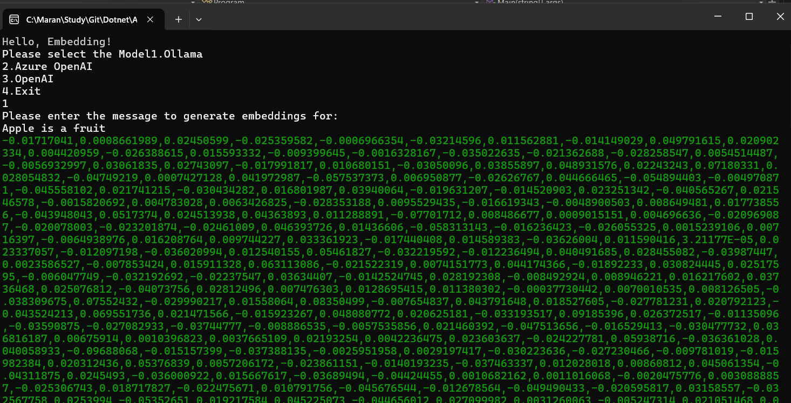

# Generate AI Embedding using OpenAI, AzureOpenAI and Ollama

A .NET 9.0 console application that demonstrates text embedding generation using multiple AI providers: Ollama, Azure OpenAI, and OpenAI.



## Features

- **Multiple AI Providers**: Support for Ollama, Azure OpenAI, and OpenAI
- **Interactive Console**: Menu-driven interface for provider selection
- **Secure Configuration**: Environment variables and user secrets support
- **Real-time Embeddings**: Generate embeddings for any text input

## Prerequisites

- .NET 9.0 SDK
- API keys for your chosen providers:
  - OpenAI API key
  - GitHub token (for Azure OpenAI)
  - Ollama running locally (for Ollama option)

## Setup

### 1. Clone and Build
```bash
git clone <repository-url>
cd AIembeddingApp
dotnet build
```

### 2. Configure API Keys

#### Option A: Environment Variables
```bash
# For OpenAI
setx OpenAIToken "your-openai-api-key"

# For Azure OpenAI
setx GitHubToken "your-github-token"
```

#### Option B: User Secrets (Recommended)
```bash
cd EmbeddingConsole
dotnet user-secrets set "OpenAIToken" "your-openai-api-key"
```

### 3. Ollama Setup (Optional)
If using Ollama, ensure it's running locally:
```bash
# Install and run Ollama with mxbai-embed-large model
ollama pull mxbai-embed-large
ollama serve
```

## Usage

1. Run the application:
```bash
cd EmbeddingConsole
dotnet run
```

2. Select your preferred AI provider:
   - **1**: Ollama (local)
   - **2**: Azure OpenAI
   - **3**: OpenAI
   - **4**: Exit

3. Enter text to generate embeddings

4. View the generated embedding vectors

## Supported Models

- **Ollama**: `mxbai-embed-large`
- **Azure OpenAI**: `text-embedding-3-small`
- **OpenAI**: `text-embedding-3-small`

## Dependencies

- Azure.AI.OpenAI (2.2.0-beta.4)
- Microsoft.Extensions.AI (9.6.0)
- Microsoft.Extensions.Configuration.UserSecrets (6.0.1)
- OllamaSharp (5.2.2)
- OpenAI (2.2.0-beta.4)

## Configuration

The application uses a hierarchical configuration approach:
1. Environment variables (highest priority)
2. User secrets (fallback)
3. Error if no configuration found

## Project Structure

```
AIembeddingApp/
├── EmbeddingConsole/
│   ├── Program.cs          # Main application logic
│   ├── EmbeddingConsole.csproj
│   └── appsettings.json
├── AIembeddingApp.sln
└── README.md
```

## License

This project is for educational and demonstration purposes.