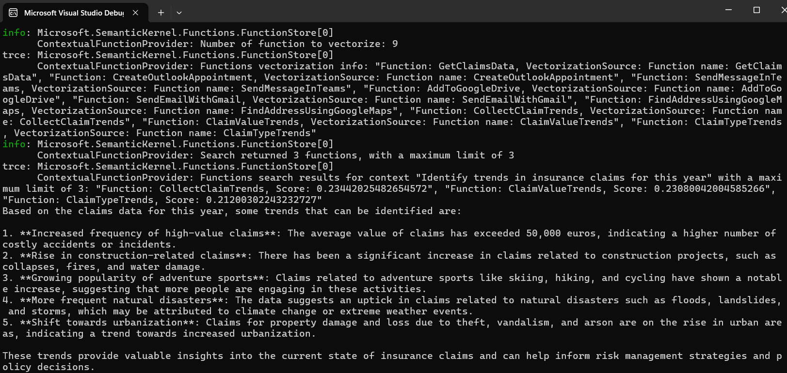
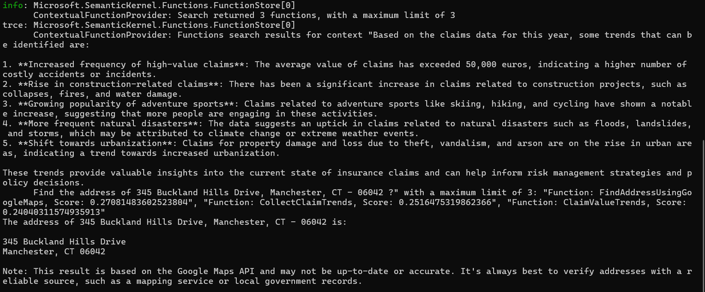

## Contextual Function Selection - Semantic Kernel Demo
This project demonstrates the use of Microsoft's Semantic Kernel to create an AI agent that can contextually select and use appropriate functions based on user queries. The application specifically showcases an insurance claim analysis scenario using local LLM models via Ollama.

### Overview
This console application creates an insurance claim agent that can analyze trends in insurance claims data. It uses:

Microsoft Semantic Kernel for AI orchestration

Ollama for local LLM inference

In-memory vector storage for contextual function selection

Contextual function providers to dynamically select relevant functions based on user queries

### Prerequisites
.NET 9.0

Ollama running locally at http://localhost:11434/

Llama 3.2 3B model installed in Ollama

### Features
- `Contextual Function Selection`: The application demonstrates how to use Semantic Kernel's contextual function selection capabilities to choose the most appropriate functions based on the user's query.

- `Insurance Claim Analysis`: Sample functions for analyzing insurance claim trends.

- `Local LLM Integration`: Uses Ollama for local LLM inference rather than cloud-based services.

- `Vector Embeddings`: Utilizes vector embeddings to match user queries with appropriate functions.

### Project Structure
- `Program.cs`: Main application code that sets up the Semantic Kernel, configures the agent, and handles the function selection logic.

- `ContextualFunSelection.csproj`: Project file with dependencies.

### Key Components
 1. `Ollama Integration`: Connects to a locally running Ollama instance for LLM capabilities.

 2. `Insurance Claim Agent`: An AI agent specialized in analyzing insurance claims data.

 3. `Contextual Function Provider`: Selects the most relevant functions based on the user's query.

 4. `In-Memory Vector Store`: Stores function embeddings for semantic matching.

 5. `Sample Functions`: Various function groups including:

      -  Claims data retrieval

      - Microsoft integration functions (Outlook, Teams)

      - Google service functions

      - Insurance claims trend analysis functions

## Usage
Run the application to see the agent analyze insurance claim trends. The application will:

Initialize the Semantic Kernel with Ollama

Create an insurance claim agent

Set up a chat thread with contextual function providers

Process a query about insurance claim trends

Output the agent's response

## Dependencies
Microsoft.SemanticKernel (1.56.0)

Microsoft.SemanticKernel.Agents.Core (1.56.0)

Microsoft.SemanticKernel.Connectors.InMemory (1.56.0-preview)

Microsoft.SemanticKernel.Connectors.Ollama (1.56.0-alpha)

Microsoft.SemanticKernel.Connectors.OpenAI (1.56.0)

Microsoft.Extensions.AI (9.6.0)

Microsoft.Extensions.Logging.Console (9.0.6)

## Output

