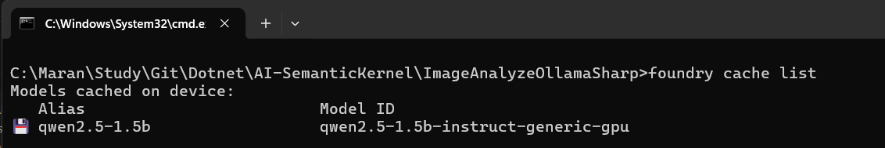
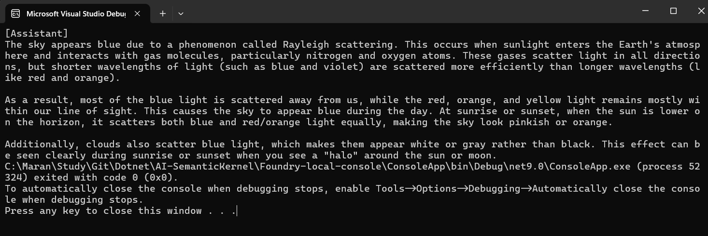

# Foundry Local Console

A .NET console application demonstrating how to use Microsoft AI Foundry Local to run AI models locally.

## Prerequisites

- .NET 9.0 SDK
- Windows, macOS, or Linux operating system
- Sufficient disk space for model downloads

## Installation

### 1. Install Foundry Local

```bash
# Install Foundry Local CLI
dotnet tool install --global Microsoft.AI.Foundry.Local.CLI

# Verify installation
foundry --version
```

### 2. Download a Model

```bash
# List available models
foundry model list

# Download a model (example: qwen2.5-1.5b)
foundry model pull qwen2.5-1.5b
```

### 3. Check Downloaded Models

```bash
# List downloaded models in your local cache
foundry cache list
```



### 4. Test the Model Directly

```bash
# Run a model directly from the CLI
foundry model run qwen2.5-1.5b --prompt "What is artificial intelligence?"
```

## Project Setup

1. Clone this repository
2. Open the solution in Visual Studio or your preferred IDE
3. Restore NuGet packages
4. Build and run the application

## How It Works

This application demonstrates:
- Starting a local model server using Foundry Local
- Connecting to the model using the OpenAI client
- Streaming chat completions from the model

## Code Example

```csharp
// Initialize Foundry Local Manager
var alias = "qwen2.5-1.5b";
var manager = await FoundryLocalManager.StartModelAsync(aliasOrModelId: alias);

// Get model info and create OpenAI client
var model = await manager.GetModelInfoAsync(aliasOrModelId: alias);
ApiKeyCredential key = new ApiKeyCredential(manager.ApiKey);
OpenAIClient client = new OpenAIClient(key, new OpenAIClientOptions
{
    Endpoint = manager.Endpoint
});
var chatClient = client.GetChatClient(model?.ModelId);

// Stream chat completion
var completionUpdates = chatClient.CompleteChatStreaming("Why is the sky blue?");
Console.Write($"[Assistant]");
foreach(var completionUpdate in completionUpdates)
{
    if(completionUpdate.ContentUpdate.Count > 0)
    {
        Console.Write(completionUpdate.ContentUpdate[0].Text);
    }
}
```
## Output



## Dependencies

- Microsoft.AI.Foundry.Local (v0.1.0)
- OpenAI (v2.2.0)

## Troubleshooting

- If you encounter issues with model downloads, check your internet connection and available disk space
- Ensure you have the latest version of Foundry Local CLI installed
- For model-specific issues, refer to the model documentation

## Additional Resources

- [Microsoft AI Foundry Documentation](https://learn.microsoft.com/en-us/ai/foundry/)
- [OpenAI .NET SDK](https://github.com/openai/openai-dotnet)