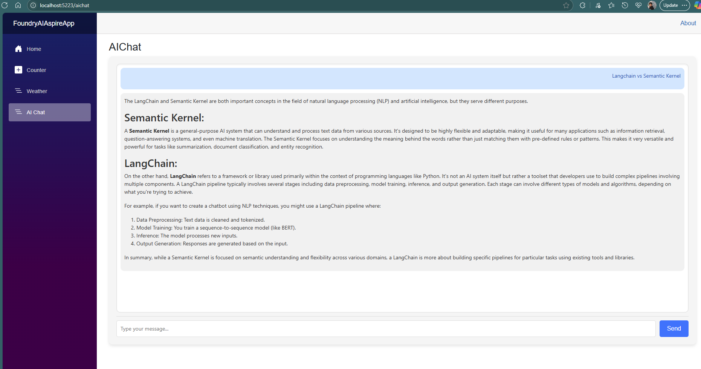

# FoundryAI Aspire App

A .NET 9 Aspire application that integrates Azure AI Foundry for AI chat functionality using a Blazor Server web interface.

## Overview

This application demonstrates the integration of Azure AI Foundry with .NET Aspire, providing a real-time AI chat interface powered by the Qwen2.5-1.5b model running locally through Azure AI Foundry.

## Architecture

The solution consists of three main projects:

- **FoundryAIAspireApp.AppHost** - Aspire orchestration host
- **FoundryAIAspireApp.Web** - Blazor Server web application with AI chat interface
- **FoundryAIAspireApp.ServiceDefaults** - Shared service configurations

## Features

- **AI Chat Interface**: Interactive chat with streaming responses
- **Azure AI Foundry Integration**: Local deployment of Qwen2.5-1.5b model
- **Real-time Streaming**: Live response streaming with markdown support
- **Blazor Server**: Interactive server-side rendering
- **Health Checks**: Built-in health monitoring
- **Telemetry**: OpenTelemetry integration for observability

## Prerequisites

- .NET 9 SDK
- Visual Studio 2022 (17.14+) or Visual Studio Code
- Azure AI Foundry (for local model deployment)

## Getting Started

1. **Clone the repository**
   ```bash
   git clone <repository-url>
   cd FoundryAIAspireApp
   ```

2. **Restore dependencies**
   ```bash
   dotnet restore
   ```

3. **Run the application**
   ```bash
   dotnet run --project FoundryAIAspireApp.AppHost
   ```

4. **Access the application**
   - Web Interface: Navigate to the provided URL (typically https://localhost:5001)
   - Aspire Dashboard: Available for monitoring and management

## Configuration

The application uses Azure AI Foundry with local deployment:

- **Model**: Qwen2.5-1.5b
- **Version**: 1
- **Publisher**: Microsoft
- **Deployment**: Local Foundry instance

## Key Components

### Web Application
- **AIChat.razor**: Main chat interface with streaming support
- **Program.cs**: Service configuration and middleware setup
- **Markdown Support**: Responses rendered with Markdig

### App Host
- **AppHost.cs**: Aspire orchestration configuration
- **Azure AI Foundry**: Local model deployment setup
- **Service Dependencies**: Health checks and startup ordering

## Dependencies

### Web Project
- `Aspire.Azure.AI.Inference` (9.4.0-preview.1.25378.8)
- `Microsoft.Extensions.AI` (9.7.1)
- `Markdig` (0.41.3)

### App Host
- `Aspire.Hosting.AppHost` (9.3.1)
- `Aspire.Hosting.Azure.AIFoundry` (9.4.0-preview.1.25378.8)

## Usage

1. Navigate to the `/aichat` page
2. Type your message in the input field
3. Press Enter or click Send
4. Watch as the AI responds with streaming text
5. Responses support markdown formatting

## Development

### Project Structure
```
FoundryAIAspireApp/
├── FoundryAIAspireApp.AppHost/          # Aspire orchestration
├── FoundryAIAspireApp.Web/              # Blazor web application
│   ├── Components/
│   │   ├── Pages/
│   │   │   └── AIChat.razor             # Main chat interface
│   │   └── Layout/                      # Application layout
│   └── wwwroot/                         # Static assets
├── FoundryAIAspireApp.ServiceDefaults/  # Shared configurations
└── README.md
```

### Key Features Implementation
- **Streaming Chat**: Uses `IChatClient.GetStreamingResponseAsync()`
- **Real-time Updates**: Blazor Server with `StateHasChanged()`
- **Markdown Rendering**: Markdig integration for rich text
- **Error Handling**: Graceful error display and recovery

## Monitoring

The application includes:
- Health check endpoints (`/health`)
- OpenTelemetry integration
- Aspire dashboard for monitoring
- Service discovery and configuration

## Example


## Contributing

1. Fork the repository
2. Create a feature branch
3. Make your changes
4. Test thoroughly
5. Submit a pull request

## License

This project is licensed under the MIT License.