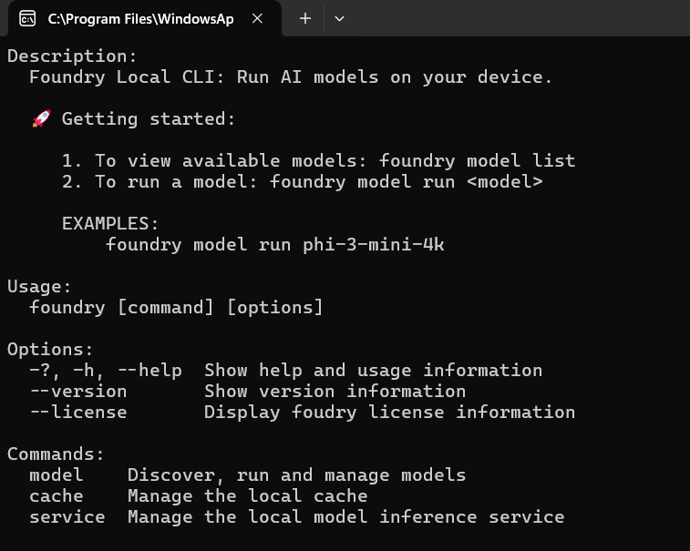
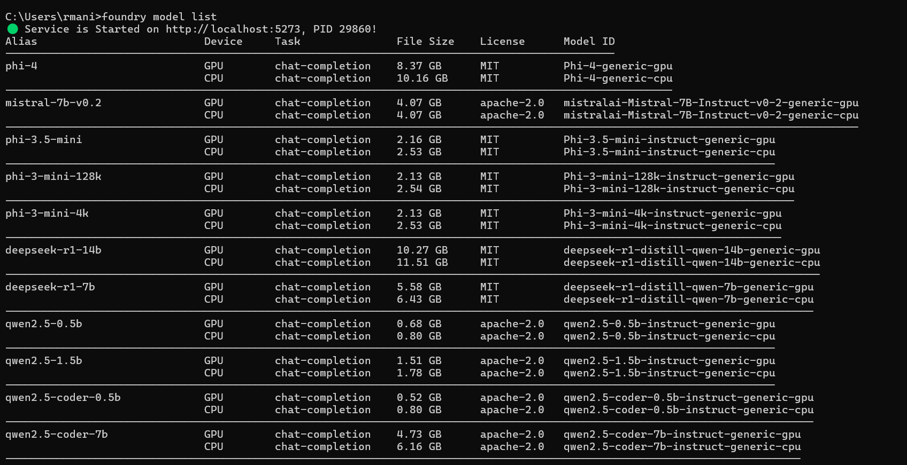
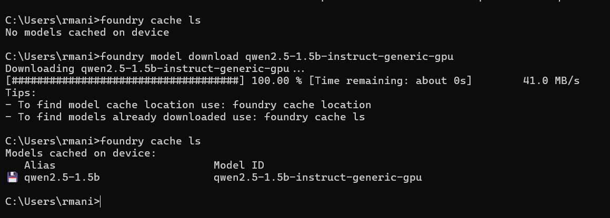
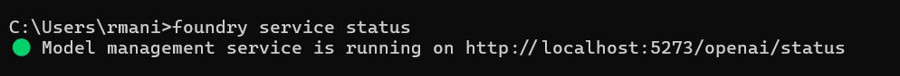
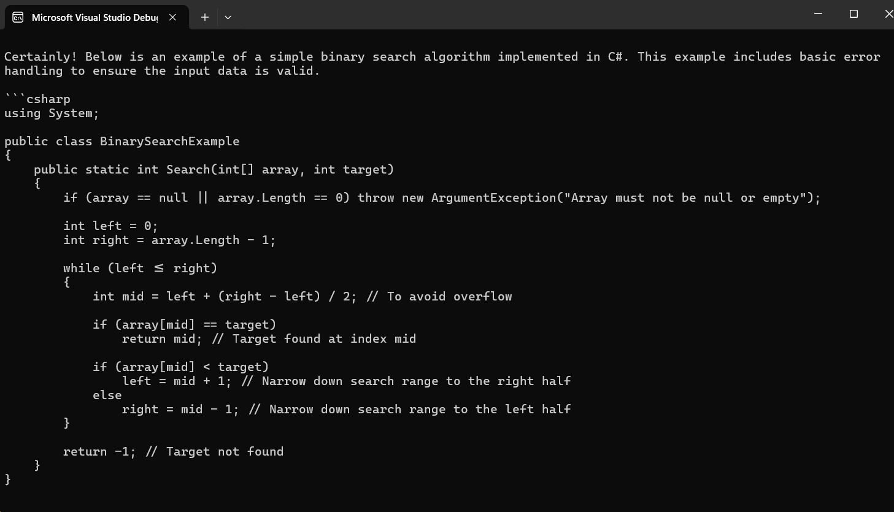

# FoundryLocalApp - Semantic Kernel with Foundry Local

A .NET 9.0 console application demonstrating how to use Microsoft Semantic Kernel with Foundry Local for local AI model inference.

## Project Structure

- **ConsoleApp**: .NET console application using Semantic Kernel
- **Target Framework**: .NET 9.0
- **Dependencies**: Microsoft.SemanticKernel v1.60.0

## Prerequisites

### 1. Install Foundry Local

Download Foundry Local from:
https://github.com/microsoft/foundry-local/releases



### 2. Download AI Model

View available models:


Download the required model:
```bash
foundry model download qwen2.5-1.5b-instruct-generic-gpu
```

Verify downloaded models:
```bash
foundry cache ls
```


### 3. Start Foundry Service

Check service status:
```bash
foundry service status
```



## Running the Application

1. Ensure Foundry Local service is running on `http://localhost:5273`
2. Build and run the console application:

```bash
cd ConsoleApp
dotnet run
```

## Application Features

- Connects to local Foundry endpoint (`http://localhost:5273/v1`)
- Uses `qwen2.5-1.5b-instruct-generic-gpu` model
- Configured as a .NET C# development expert
- Demonstrates streaming response generation
- Example: Generates C# binary search implementation

## Configuration

- **Model**: qwen2.5-1.5b-instruct-generic-gpu
- **Endpoint**: http://localhost:5273/v1
- **Temperature**: 0.7
- **Max Tokens**: 32,768