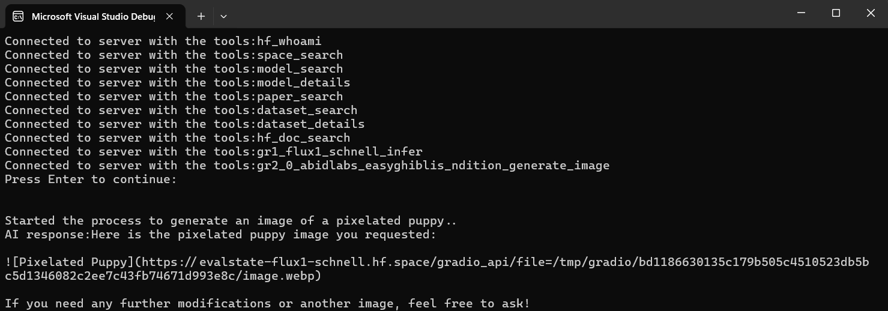
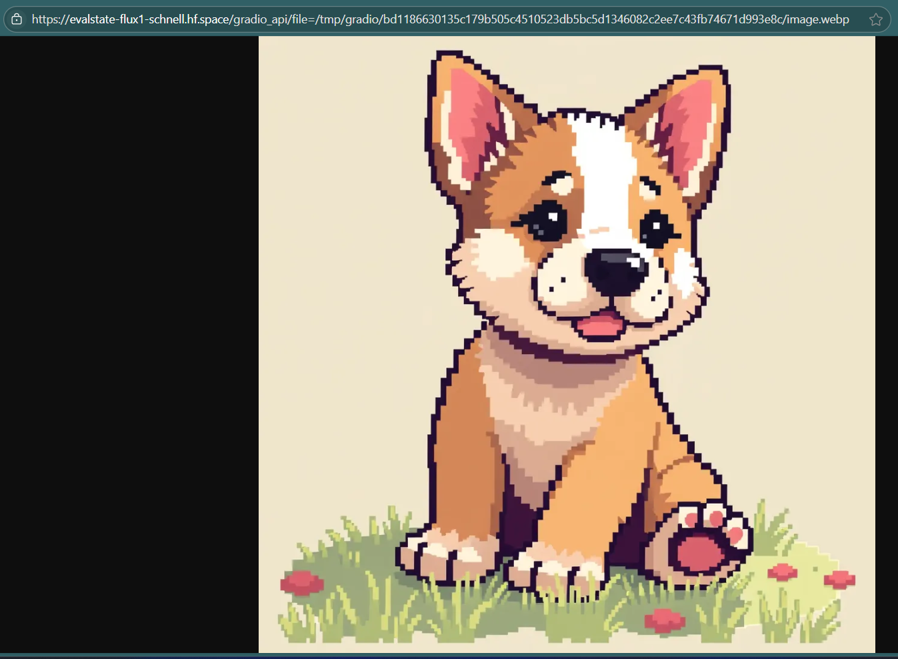

# HuggingFace MCP Access

A .NET 9 console application that demonstrates integration between HuggingFace's Model Context Protocol (MCP) server and AI chat clients using Microsoft Extensions AI.

## Features

- Connects to HuggingFace MCP server for tool access
- Supports both GitHub Models and Azure OpenAI as chat providers
- Demonstrates AI-powered image generation using MCP tools
- Built with Microsoft Extensions AI framework

## Prerequisites

- .NET 9.0 SDK
- HuggingFace token (for MCP server access)
- Either:
  - GitHub token (for GitHub Models)
  - Azure OpenAI credentials

## Configuration

Set up the following environment variables or user secrets:

```bash
# Required
HF_TOKEN=your_huggingface_token

# For GitHub Models (preferred)
GITHUB_TOKEN=your_github_token

# For Azure OpenAI (alternative)
AzureOpenAI:Endpoint=your_azure_openai_endpoint
AzureOpenAI:ApiKey=your_azure_openai_key
AzureOpenAI:DeploymentName=your_deployment_name
```

## Usage

1. Clone the repository
2. Navigate to the ConsoleApp directory
3. Configure your tokens/credentials
4. Run the application:

```bash
dotnet run
```

The application will:
1. Connect to HuggingFace MCP server
2. List available tools
3. Generate an image of a pixelated puppy using AI and MCP tools


## Output:





## Dependencies

- Microsoft.Extensions.AI (9.8.0)
- Microsoft.Extensions.Hosting (9.0.8)
- ModelContextProtocol (0.3.0-preview.3)
- ModelContextProtocol-SemanticKernel (0.3.0)
- ModelContextProtocol.Core (0.3.0-preview.3)