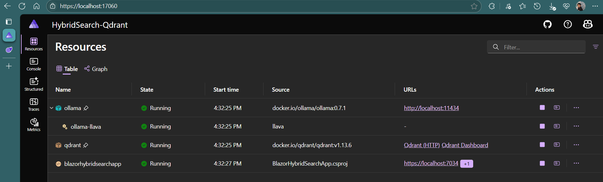
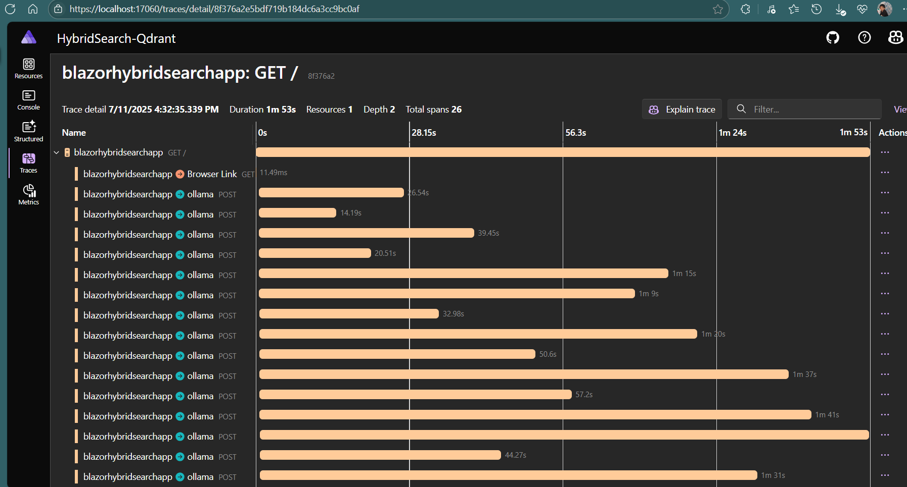
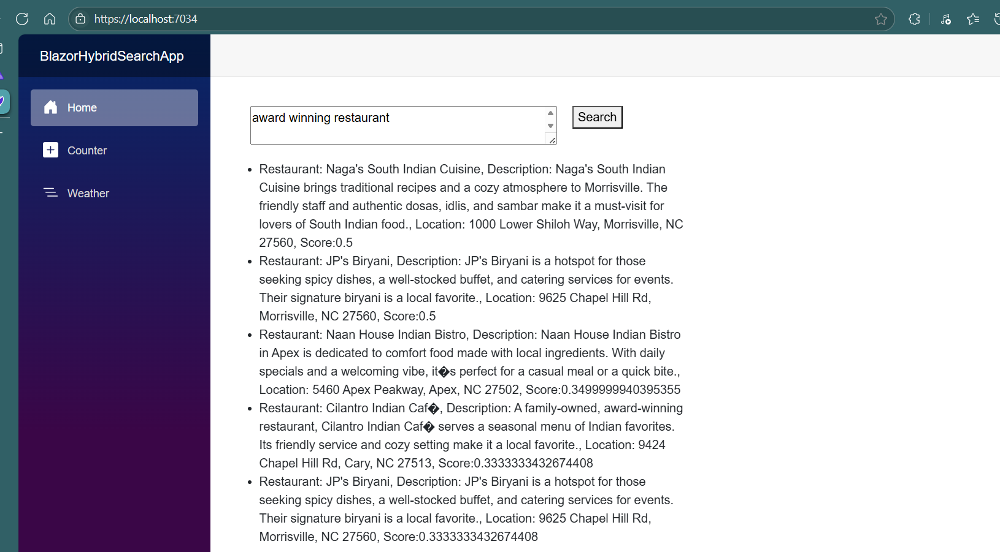
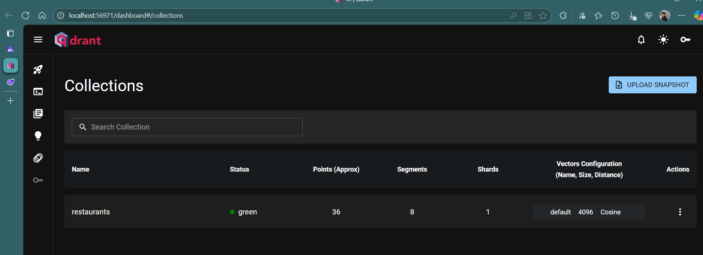

# Hybrid Search with Qdrant and Ollama using .NET Aspire

A modern .NET 9 application demonstrating hybrid search capabilities using Qdrant vector database, Ollama embeddings, and Semantic Kernel, all orchestrated with .NET Aspire hosting.

## Overview

This project showcases a restaurant search application that combines semantic vector search with traditional keyword search to provide more accurate and contextually relevant results. The application uses:

- **Qdrant** - Vector database for storing and searching embeddings
- **Ollama** - Local LLM for generating embeddings
- **Semantic Kernel** - Microsoft's AI orchestration framework
- **.NET Aspire** - Cloud-native application orchestration
- **Blazor Server** - Interactive web UI

## Architecture

### Components

1. **HybridSearch-Qdrant.AppHost** - .NET Aspire orchestrator that manages:
   - Qdrant vector database container
   - Ollama LLM container with llava model
   - Blazor web application

2. **BlazorHybridSearchApp** - Main web application featuring:
   - Interactive search interface
   - Restaurant data management
   - Hybrid search implementation
   - Real-time results display

3. **HybridSearch-Qdrant.ServiceDefaults** - Shared service configurations

### Data Flow

1. Restaurant data is loaded from JSON and converted to embeddings
2. Embeddings are stored in Qdrant with full-text indexing
3. User queries are converted to embeddings using Ollama
4. Hybrid search combines vector similarity and keyword matching
5. Results are ranked and displayed with relevance scores

## Features

- **Hybrid Search**: Combines semantic vector search with keyword matching
- **Real-time Embeddings**: Uses Ollama's llava model for local embedding generation
- **Persistent Storage**: Qdrant containers with persistent lifetime
- **Interactive UI**: Blazor Server with real-time search results
- **Containerized**: Full Docker-based deployment with .NET Aspire
- **Scalable Architecture**: Service-oriented design with dependency injection

## Prerequisites

- .NET 9 SDK
- Docker Desktop
- Visual Studio 2022 or VS Code with C# extension
- .NET Aspire workload (`dotnet workload install aspire`)

## Getting Started

### 1. Clone the Repository
```bash
git clone <repository-url>
cd HybridSearch-Qdrant
```

### 2. Restore Dependencies
```bash
dotnet restore
```

### 3. Run with .NET Aspire
```bash
cd HybridSearch-Qdrant.AppHost
dotnet run
```

This will:
- Start Qdrant container on port 6333
- Start Ollama container on port 11434 with llava model
- Launch the Blazor application
- Open the Aspire dashboard

### 4. Access the Application

- **Blazor App**: Navigate to the URL shown in the Aspire dashboard
- **Aspire Dashboard**: Usually at `https://localhost:17000`
- **Qdrant Dashboard**: `http://localhost:6333/dashboard`

## Usage

1. **Data Loading**: The application automatically loads restaurant data from `wwwroot/Data/restaurant.json` on startup
2. **Search**: Enter search queries like:
   - "romantic restaurant with cocktails"
   - "family-friendly Indian food in Cary"
   - "spicy biryani with parking"
3. **Results**: View ranked results with relevance scores

## Project Structure

```
HybridSearch-Qdrant/
├── BlazorHybridSearchApp/
│   ├── Components/Pages/Home.razor    # Main search interface
│   ├── Models/RestaurantDataForVector.cs  # Data models
│   ├── Services/DataService.cs        # Search logic
│   └── wwwroot/Data/restaurant.json   # Sample data
├── HybridSearch-Qdrant.AppHost/
│   └── Program.cs                     # Aspire orchestration
└── HybridSearch-Qdrant.ServiceDefaults/
    └── Extensions.cs                  # Shared configurations
```

## Key Technologies

- **.NET 9**: Latest .NET framework
- **Semantic Kernel 1.60.0**: AI orchestration
- **Qdrant**: Vector database with hybrid search
- **Ollama**: Local LLM hosting
- **Aspire 9.3.1**: Cloud-native orchestration
- **Blazor Server**: Interactive web UI

## Configuration

Key settings in `appsettings.json`:
```json
{
  "LLMSettings": {
    "OllamaEmbeddingModelId": "llava",
    "OllamaEndpoint": "http://localhost:11434",
    "QdrantCollectionName": "restaurants"
  }
}
```

## Screenshots

### .NET Aspire Dashboard


### Initial Embeddings Traces

*vector embedding calls to ollama*

### Hybrid Search Results

*Interactive search interface with real-time results*

### Qdrant Dashboard

*Vector database management interface*

## Development

### Adding New Data
1. Update `restaurant.json` with new entries
2. Restart the application to reload data
3. The DataService will automatically generate embeddings

### Customizing Search
- Modify `HybridSearchOptions` in `DataService.cs`
- Adjust vector dimensions in `RestaurantDataForVector.cs`
- Change embedding models in `Program.cs`

## Troubleshooting

- **Container Issues**: Ensure Docker Desktop is running
- **Model Loading**: Ollama may take time to download the llava model on first run
- **Port Conflicts**: Check if ports 6333 or 11434 are already in use
- **Memory**: Ensure sufficient RAM for Ollama model (4GB+ recommended)

## Contributing

Contributions are welcome! Please feel free to submit issues and pull requests.

## License

This project is for educational purposes and demonstrates modern .NET AI application development patterns.
