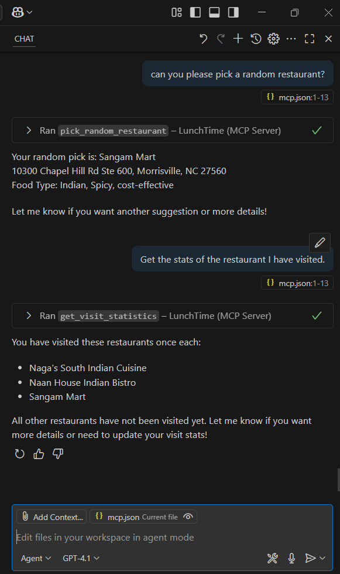

# LunchTime MCP Server

A Model Context Protocol (MCP) server for managing restaurant lunch options. Built with .NET 9 and the ModelContextProtocol library.

## Features

- **Restaurant Management**: Add, remove, and list restaurants
- **Random Selection**: Pick a random restaurant for lunch
- **Visit Tracking**: Track how many times each restaurant has been visited
- **Statistics**: Get formatted visit statistics for all restaurants
- **Persistent Storage**: Data stored in JSON format in user's AppData folder

## Available Tools

- `GetRestaurants` - Get a list of all available restaurants
- `PickRandomRestaurant` - Randomly select a restaurant for lunch
- `AddRestaurant` - Add a new restaurant with name, address, and food type
- `RemoveRestaurant` - Remove a restaurant by ID
- `GetVisitStatistics` - Get statistics about restaurant visits

## Setup

1. Build the project:
   ```bash
   dotnet build
   ```

2. Run the MCP server:
   ```bash
   dotnet run
   ```

3. Configure your MCP client to connect to this server via stdio transport.

## Data Storage

Restaurant data is stored in: `%APPDATA%\LunchTimeMcpApp\restaurants.json`

The server comes pre-loaded with Indian restaurants in the Raleigh-Durham area.

