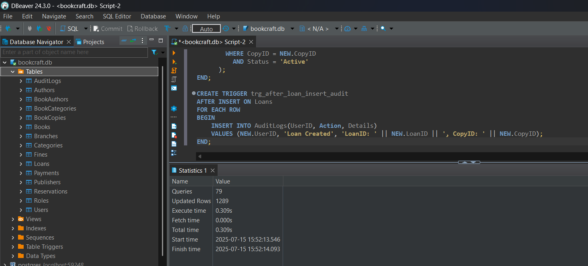
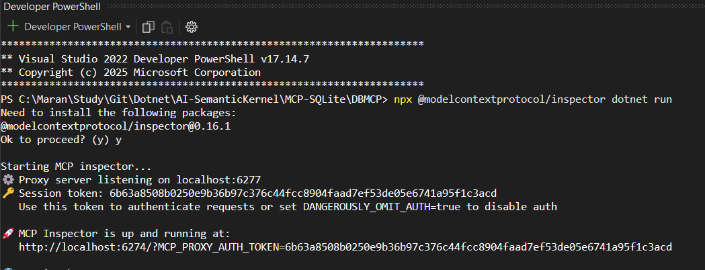
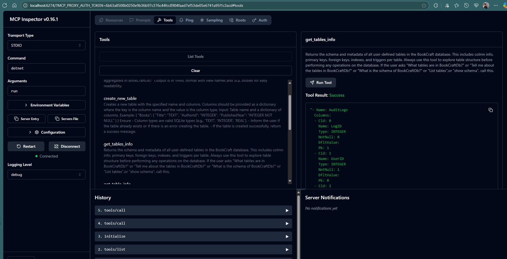
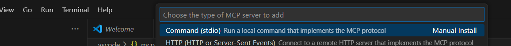
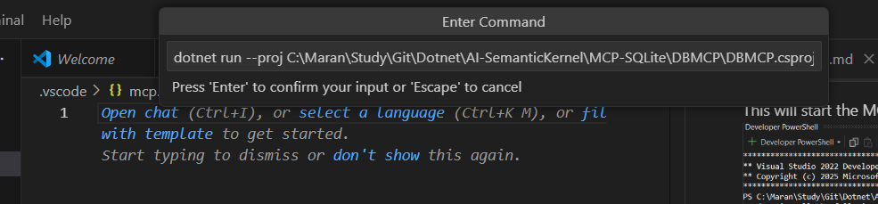
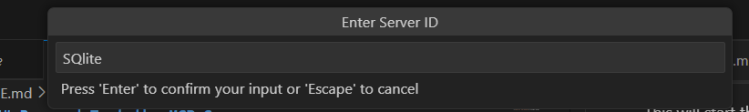
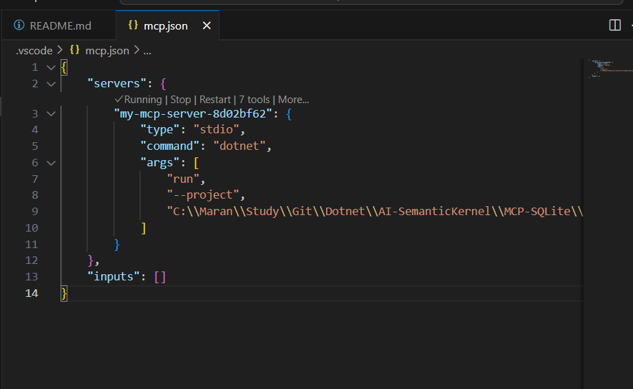
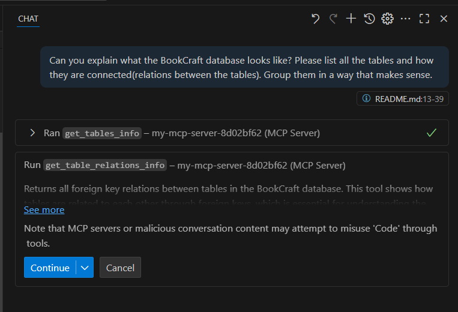

### Run and Test the MCP Server

- Using the MCP Inspector tool.
- Open the command prompt and locate to the project.
- Run the below command.
```bash
> npx @modelcontextprotocol/inspector dotnet run
```
This will start the MCP server with MCP Inspector.


On the opened browser select connect.
Click Tools > List Tools to list the tools available in the MCP server.


### Connect MCP through VS Code Copilot
- Copy the path of your csproj. 
- Create a new folder named .vscode
- Inside the folder create a file named mcp.json.
- Double click and open the mcp.json file.
- In VSCode you will get a Add Server button. 
- Click the Add server and select command(stdio)









### Now ask the questions.
Question 1: Can  you explain what the BookCraft database looks like? Please list all the tables and how they are connected(relations between the tables). Group them in a way that makes sense.

- This will connect to our MCP server and ask for permission to run the get_tables_info.
