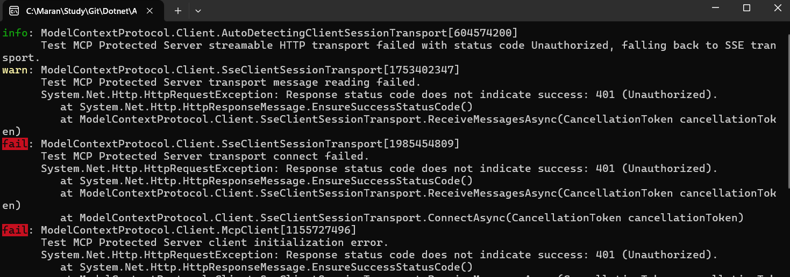
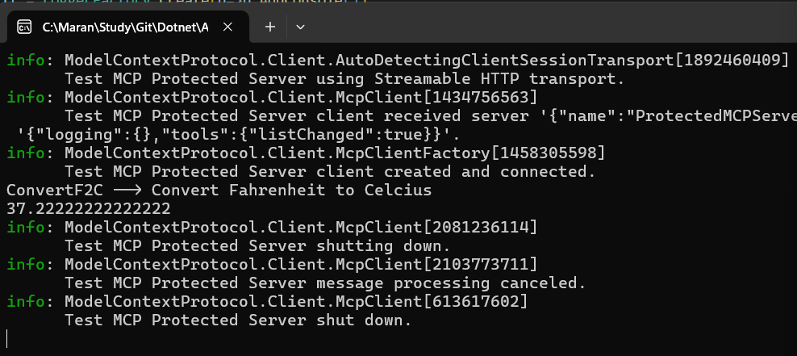

# Protected MCP Server Client Application

A demonstration of **Model Context Protocol (MCP)** with JWT authentication using .NET 9. This project shows how to secure MCP servers and handle both authorized and unauthorized access scenarios.

## What is MCP?

Model Context Protocol (MCP) is a standard for connecting AI assistants to external tools and data sources. It allows AI models to interact with various services through a unified interface.

## Project Overview

This solution contains two main components:

### 1. ProtectedMCPServer
- **ASP.NET Core Web API** that hosts MCP tools
- **JWT Bearer Authentication** for security
- **Temperature conversion tool** as a sample MCP tool
- Runs on `https://localhost:7222/`

### 2. ProtectedMCPClient
- **Console application** that connects to the MCP server
- Demonstrates both **authorized** and **unauthorized** access
- Uses **Server-Sent Events (SSE)** for communication

## Key Features

- ✅ **JWT Authentication** - Secure access control
- ✅ **MCP Tool Integration** - Temperature conversion example
- ✅ **Authorization Demo** - Shows protected vs unprotected access
- ✅ **.NET 9** - Latest .NET framework

## Prerequisites

- .NET 9 SDK
- Visual Studio 2022 or VS Code
- Basic understanding of C# and web APIs

## Getting Started

### 1. Clone and Build
```bash
git clone <repository-url>
cd ProtectedMCPServerClientApp
dotnet build
```

### 2. Run the MCP Server
```bash
cd ProtectedMCPServer
dotnet run
```
Server will start at `https://localhost:7222/`

### 3. Run the MCP Client
```bash
cd ProtectedMCPClient
dotnet run
```

## Authentication Flow

### Authorized Access (Default)
The client includes a JWT token in the Authorization header:
```csharp
["Authorization"] = $"Bearer {CreateJWT()}"
```

### Unauthorized Access (For Testing)
Comment out the Authorization header in `ProtectedMCPClient/Program.cs`:
```csharp
// ["Authorization"] = $"Bearer {CreateJWT()}"
```

## Demo Scenarios

### Scenario 1: Unauthorized Access


When no JWT token is provided, the server returns a 401 Unauthorized response.

### Scenario 2: Authorized Access


With a valid JWT token, the client can successfully call MCP tools.

## Code Structure

### MCP Server Configuration
```csharp
// JWT Authentication setup
builder.Services.AddAuthentication()
    .AddJwtBearer(/* JWT validation parameters */)
    .AddMcp();

// MCP Server with tools
builder.Services.AddMcpServer()
    .WithToolsFromAssembly()
    .WithHttpTransport();

// Require authorization for MCP endpoints
app.MapMcp().RequireAuthorization();
```

### Sample MCP Tool
```csharp
[McpServerToolType]
public class TemperatureTool
{
    [McpServerTool(Name ="ConvertF2C")]
    public static double ConvertF2C(double fTemp)
    {
        return (fTemp - 32) * 5.0 / 9.0;
    }
}
```

### Client Connection
```csharp
// Create SSE transport with optional JWT token
SseClientTransport transport = new(
    new() {
        Endpoint = new Uri(MCPServerUrl),
        AdditionalHeaders = new Dictionary<string, string> {
            ["Authorization"] = $"Bearer {CreateJWT()}"
        }
    });

// Connect and call tools
var mcpClient = await McpClientFactory.CreateAsync(transport);
var result = await mcpClient.CallToolAsync("ConvertF2C", parameters);
```

## Key Dependencies

### Server
- `ModelContextProtocol.AspNetCore` - MCP server implementation
- `Microsoft.AspNetCore.Authentication.JwtBearer` - JWT authentication

### Client
- `ModelContextProtocol` - MCP client implementation
- `System.IdentityModel.Tokens.Jwt` - JWT token creation

## Security Configuration

**JWT Settings:**
- **Issuer:** `at-mcp-server`
- **Audience:** `at-audience`
- **Secret Key:** `YOUR_TOP_$ECRET_Key_here_1234_4321` (⚠️ Change in production!)
- **Expiry:** 1 hour

## Learning Points

1. **MCP Protocol** - Understanding tool-based AI interactions
2. **JWT Authentication** - Securing API endpoints
3. **ASP.NET Core** - Building web APIs with authentication
4. **Server-Sent Events** - Real-time communication
5. **Dependency Injection** - .NET service configuration

## Next Steps

- Add more complex MCP tools
- Implement role-based authorization
- Add logging and monitoring
- Create custom authentication providers
- Integrate with AI models like OpenAI or Azure OpenAI

## Troubleshooting

**Common Issues:**
- **Port conflicts:** Change port in `launchSettings.json`
- **SSL certificate:** Trust development certificates with `dotnet dev-certs https --trust`
- **JWT validation:** Ensure secret keys match between server and client

---

*This project demonstrates the fundamentals of building secure MCP servers with .NET, providing a foundation for more complex AI tool integrations.*