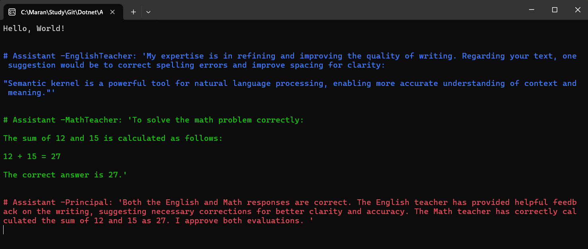

# Semantic Kernel Multi-Agent Demo

## Overview
This project demonstrates the use of Microsoft's Semantic Kernel to create a multi-agent system where different AI agents collaborate to solve problems. The demo showcases how specialized agents can work together in a coordinated manner to process user requests.

## Features
- **Multi-Agent Architecture**: Implements a group chat with specialized agents
- **Role-Based Agents**: 
  - English Teacher Agent: Corrects grammar and improves text structure
  - Math Teacher Agent: Solves mathematical problems
  - Principal Agent: Reviews and approves the work of other agents
- **Termination Strategy**: Custom approval-based termination logic

## output

## Technical Details
- Built with .NET 9.0
- Uses Microsoft Semantic Kernel v1.54.0
- Integrates with OpenAI's GPT-4o model

## How It Works
1. The system initializes three specialized agents with specific roles and instructions
2. User messages are processed in a group chat environment
3. Each agent contributes based on their expertise
4. The Principal agent determines when the conversation is complete
5. Results are displayed with color-coded console output

## Getting Started
1. Clone the repository
2. Update the API key in `Config.cs` with your own OpenAI API key
3. Build and run the application

## Dependencies
- Microsoft.SemanticKernel (1.54.0)
- Microsoft.SemanticKernel.Agents.Abstractions (1.54.0)
- Microsoft.SemanticKernel.Agents.Core (1.54.0)

## Note
This project uses experimental features from Semantic Kernel that may change in future updates.