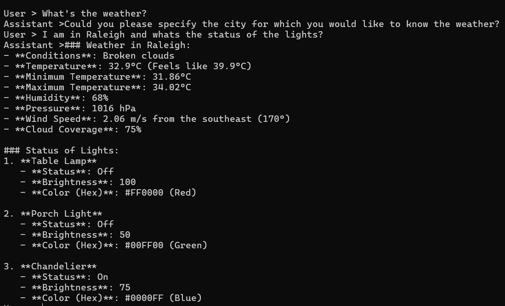
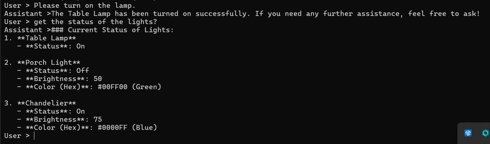
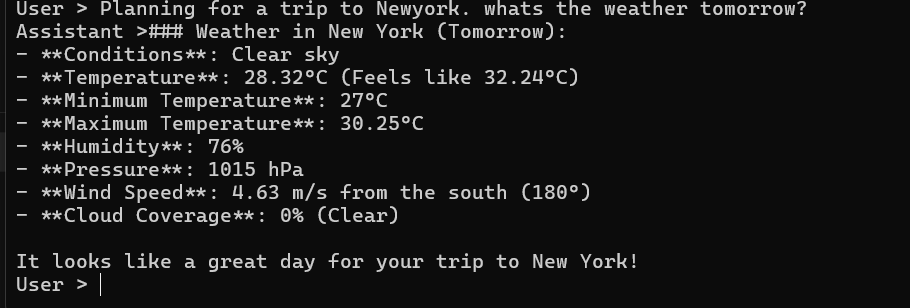
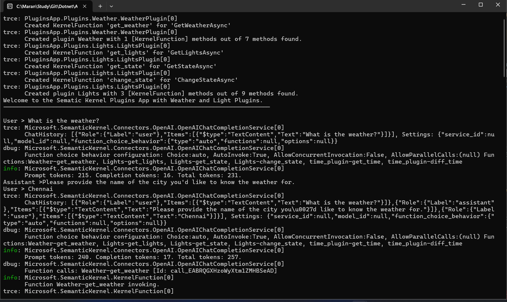
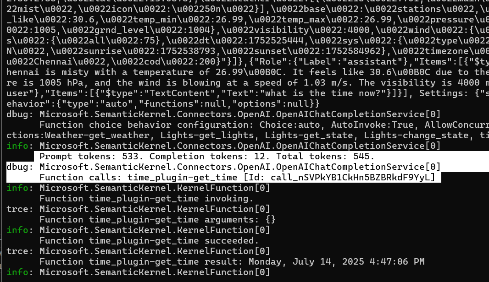

# Semantic Kernel Plugins Demo

A .NET 9.0 console application demonstrating Microsoft Semantic Kernel with custom plugins for Weather and Lights control, showcasing AI-powered function calling capabilities.

## Features

- **Weather Plugin**: Real-time weather data retrieval using OpenWeatherMap API
- **Lights Plugin**: Smart home light control simulation with state management
- **Time Plugin**: Current time and time difference calculations
- **AI Chat Interface**: Interactive conversation with function calling
- **Multiple AI Providers**: Support for both OpenAI and Azure OpenAI

## Prerequisites

- .NET 9.0 SDK
- OpenAI API Key or Azure OpenAI credentials
- OpenWeatherMap API Key (for weather functionality)

## Setup

### 1. Clone the Repository
```bash
git clone <repository-url>
cd SK-Plugins-Weather
```

### 2. Configure API Keys

#### Option A: User Secrets (Recommended)
```bash
cd PluginsApp
dotnet user-secrets set "LLM:ApiKey" "your-openai-api-key"
dotnet user-secrets set "Weather:ApiKey" "your-openweathermap-api-key"
```

#### Option B: appsettings.json
Update `PluginsApp/appsettings.json`:
```json
{
  "LLM": {
    "DeploymentOrModelId": "gpt-4o",
    "ApiKey": "your-openai-api-key"
  },
  "Weather": {
    "ApiKey": "your-openweathermap-api-key"
  }
}
```

### 3. Build and Run
```bash
dotnet build
dotnet run --project PluginsApp
```

## Usage

The application provides an interactive chat interface where you can:

- **Weather Queries**: "What's the weather in London?"
- **Light Control**: "Turn on the table lamp", "Set chandelier brightness to 80%"
- **Time Functions**: "What time is it?", "Calculate time difference between dates"
- **Combined Operations**: "Turn on porch light and tell me the weather in Paris"

Type `exit` to quit the application.

## Project Structure

```
SK-Plugins-Weather/
├── PluginsApp/
│   ├── Plugins/
│   │   ├── Weather/
│   │   │   └── WeatherPlugin.cs     # OpenWeatherMap integration
│   │   └── Lights/
│   │       └── LightsPlugin.cs      # Smart lights simulation
│   ├── Program.cs                   # Main application entry
│   ├── Config.cs                    # Configuration management
│   ├── AzureOpenAIConfig.cs        # Azure OpenAI settings
│   └── PluginsApp.csproj           # Project dependencies
└── README.md
```

## Key Dependencies

- **Microsoft.SemanticKernel** (1.60.0) - Core AI orchestration
- **Microsoft.Extensions.Configuration** - Configuration management
- **Microsoft.Extensions.Logging** - Logging infrastructure

## Plugin Details

### Weather Plugin
- **Function**: `get_weather`
- **Description**: Fetches current weather data for specified cities
- **API**: OpenWeatherMap REST API
- **Returns**: JSON weather data with temperature, conditions, etc.

### Lights Plugin
- **Functions**: `get_lights`, `get_state`, `change_state`
- **Features**: Control 3 simulated lights (Table Lamp, Porch Light, Chandelier)
- **Properties**: On/Off state, brightness (0-100), color (hex)

### Time Plugin
- **Functions**: `get_time`, `diff_time`
- **Features**: Current time display and time calculations

## Configuration Options

### AI Provider Selection
Switch between OpenAI and Azure OpenAI by commenting/uncommenting lines in `Program.cs`:

```csharp
// OpenAI
var builder = Kernel.CreateBuilder().AddOpenAIChatCompletion(Config.DeploymentOrModelId, Config.ApiKey);

// Azure OpenAI
// var builder = Kernel.CreateBuilder().AddAzureOpenAIChatCompletion(AzureOpenAIConfig.ModelName, AzureOpenAIConfig.Endpoint, AzureOpenAIConfig.ApiKey);
```

### Logging
Enable trace logging to see detailed function calling:
```csharp
builder.Services.AddLogging(services => services.AddConsole().SetMinimumLevel(LogLevel.Trace));
```

## Screenshots

### Basic Execution


### Weather Plugin Demo


### Lights Plugin Demo


### With Log Trace Enabled




## Troubleshooting

- **API Key Issues**: Ensure your OpenAI and OpenWeatherMap API keys are correctly configured
- **Network Errors**: Check internet connectivity for API calls
- **Build Errors**: Verify .NET 9.0 SDK is installed
- **Plugin Not Working**: Check function descriptions and parameter types

## License

This project is for educational purposes demonstrating Semantic Kernel capabilities.