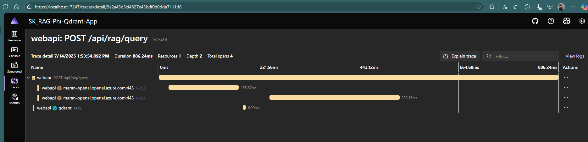

# SK RAG Phi Qdrant App

A Retrieval-Augmented Generation (RAG) application built with .NET 9, Semantic Kernel, and Qdrant vector database, supporting multiple LLM providers. The application demonstrates product search and question-answering capabilities using vector embeddings and semantic search.

## Features

- **Multi-LLM Support**: Switch between OpenAI, Azure OpenAI, GitHub Models, Ollama, and ONNX providers
- **Vector Search**: Qdrant vector database for semantic similarity search
- **Product Catalog**: Pre-loaded with 10 tech products for demonstration
- **RAG Pipeline**: Complete retrieval-augmented generation workflow
- **REST API**: Clean endpoints for initialization, querying, and product management
- **.NET Aspire**: Modern cloud-native application orchestration

## Architecture

- **WebApi**: Main application with RAG endpoints and services
- **AppHost**: .NET Aspire orchestration for Qdrant and web services
- **ServiceDefaults**: Shared configuration and telemetry
- **Qdrant**: Vector database for embeddings storage and similarity search

## API Endpoints

- `GET /api/rag/products` - Retrieve all products
- `POST /api/rag/initialize` - Initialize Qdrant collection with product embeddings
- `POST /api/rag/query` - Query products using natural language with RAG

## Supported LLM Types

**OPENAI**: Direct integration with OpenAI's GPT models and embedding services.  
Provides access to GPT-4 for chat completion and text-embedding-3-small for vector embeddings.

**AZUREOPENAI**: Enterprise-grade Azure OpenAI service integration with enhanced security and compliance.  
Offers the same GPT-4 and embedding capabilities through Microsoft's Azure cloud platform.

**GITHUB**: GitHub Models API integration for accessing AI models through GitHub's platform.  
Enables developers to use OpenAI models via GitHub's unified AI model marketplace.

**OLLAMA**: Local LLM deployment using Ollama for privacy-focused, on-premises AI inference.  
Allows running open-source models locally without external API dependencies (currently commented out).

**ONNX**: High-performance local inference using ONNX Runtime with Phi-3-mini model.  
Provides CPU-optimized local AI processing with BGE-micro-v2 embeddings for complete offline operation.

## Configuration

Set the LLM provider in `appsettings.json`:
```json
{
  "LLMType": "OPENAI",
  "OpenAIKey": "your-api-key"
}
```

## Getting Started

1. Configure your preferred LLM provider in settings
2. Run the application using .NET Aspire
3. Initialize the RAG system: `POST /api/rag/initialize`
4. Query products: `POST /api/rag/query` with natural language questions

### Azure OpenAI:


### OpenAI :


### Github Model


## License

This project is for educational purposes demonstrating Semantic Kernel structured output capabilities.