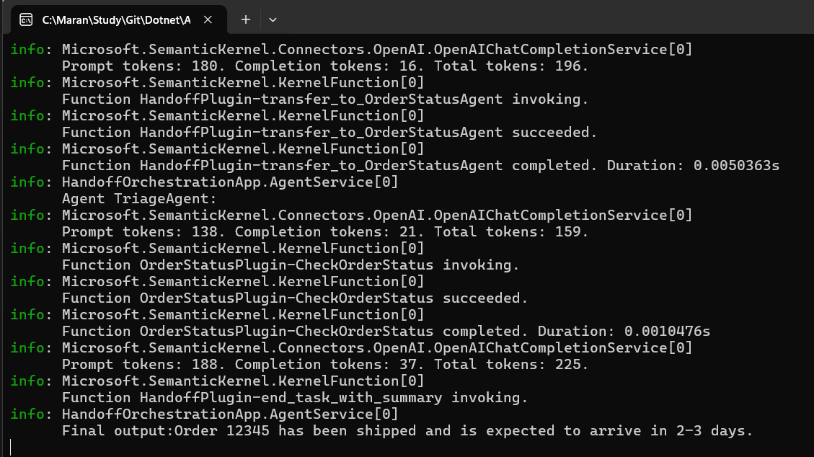
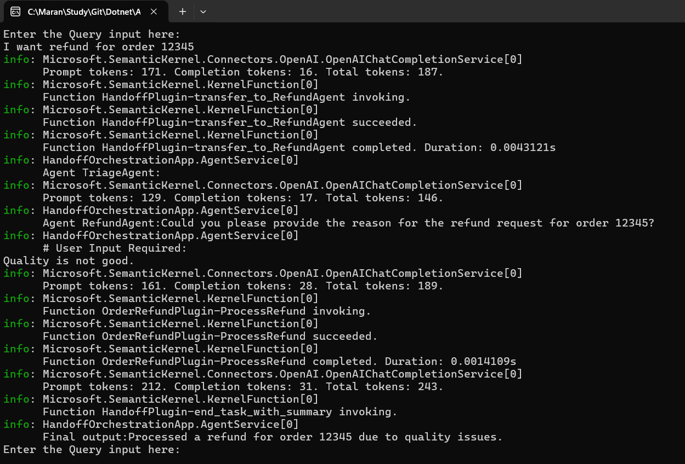
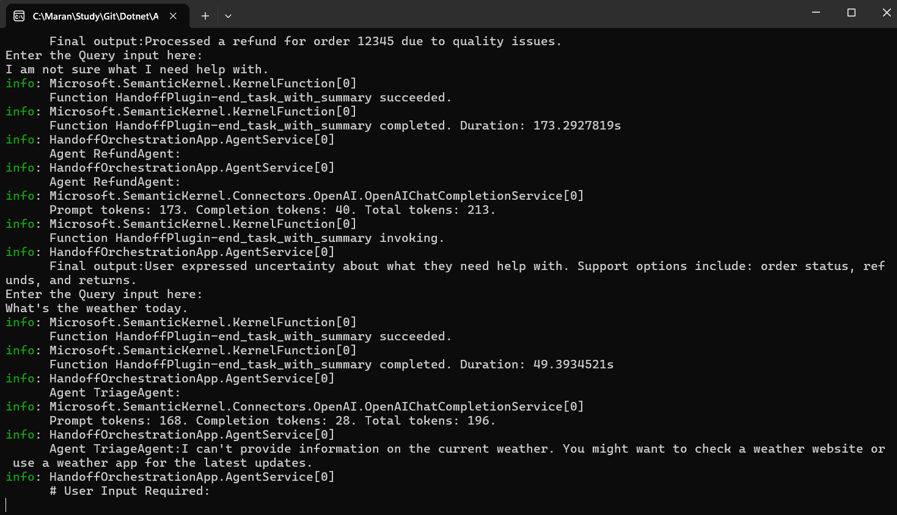
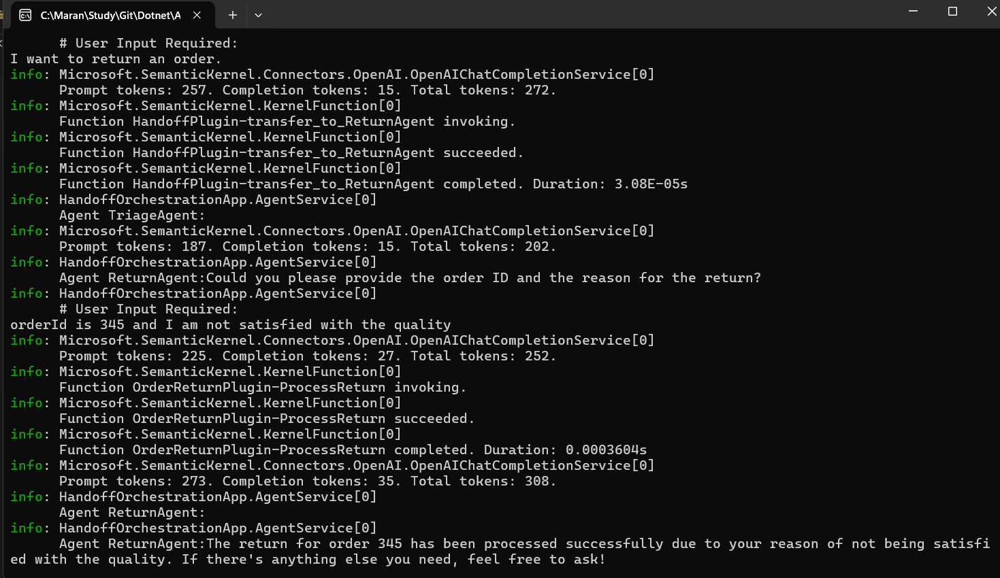

# HandOff Orchestration Pattern

The HandOff Orchestration pattern demonstrates how agents can intelligently transfer control to specialized agents based on the nature of the request. This pattern is ideal for customer support scenarios where different types of requests need different expertise.

## What is HandOff Orchestration?

HandOff Orchestration allows agents to:
- **Analyze incoming requests** and determine the best agent to handle them
- **Transfer control** seamlessly between specialized agents
- **Request user input** when additional information is needed
- **Fall back** to a triage agent when the current agent can't handle the request

## Architecture Overview

This implementation features a **customer support system** with:

### Agents
1. **TriageAgent**: Initial request analyzer and router
2. **OrderStatusAgent**: Handles order status inquiries
3. **RefundAgent**: Processes refund requests
4. **ReturnAgent**: Manages return requests

### Plugins
- **OrderStatusPlugin**: Checks order status
- **OrderRefundPlugin**: Processes refunds
- **OrderReturnPlugin**: Handles returns

## How It Works

1. **User submits request** → TriageAgent analyzes intent
2. **TriageAgent routes** to appropriate specialist agent
3. **Specialist agent** uses relevant plugins to process request
4. **If needed**, agent can hand back to TriageAgent or request user input

## Example Scenarios

### Order Status Inquiry
```bash
# Input provided
I need help with my order 12345. Can you tell me its status?
```


*Invoked Status Plugin from triage*

**Flow**: User Request → TriageAgent → OrderStatusAgent → OrderStatusPlugin → Response

### Refund Request
```bash
# Input provided
I want refund for order 12345.
```


*Refund request with user Input in the middle*




*Refund request with user input*

**Flow**: User Request → TriageAgent → RefundAgent → (User Input Required) → OrderRefundPlugin → Response

## Key Features

- **Intelligent Routing**: Automatic agent selection based on request type
- **Interactive Callbacks**: Requests user input when needed
- **Plugin Integration**: Each agent has specialized tools
- **Fallback Mechanism**: Agents can transfer back to triage
- **Continuous Loop**: Handles multiple requests in one session

## Configuration

Create `appsettings.json` with your API keys:

```json
{
  "OpenAIConfig": {
    "DeploymentOrModelId": "gpt-4o",
    "ApiKey": "your-openai-api-key"
  },
  "AzureOpenAIConfig": {
    "Endpoint": "https://your-endpoint.openai.azure.com/",
    "ApiKey": "your-azure-api-key",
    "DeploymentOrModelId": "gpt-4o-mini"
  }
}
```

## Running the Example

```bash
dotnet run --project HandoffOrchestration
```

**Interactive Mode**: The application runs in a loop, allowing you to test different scenarios:
- Order status: "What's the status of order 12345?"
- Refund request: "I want a refund for order 12345"
- Return request: "I need to return order 12345"
- Type "exit" or "close" to quit

## When to Use HandOff Orchestration

✅ **Perfect for**:
- Customer support systems
- Multi-step workflows requiring different expertise
- Scenarios where user input is needed mid-process
- Complex routing based on request analysis

❌ **Not ideal for**:
- Simple linear workflows (use Sequential instead)
- Scenarios where all agents work simultaneously (use Concurrent instead)

## Extending the Pattern

You can easily add new agents and plugins:

1. **Create new agent** with specific instructions
2. **Add plugins** for the agent's functionality
3. **Configure handoffs** in the orchestration setup
4. **Update triage logic** to route to the new agent