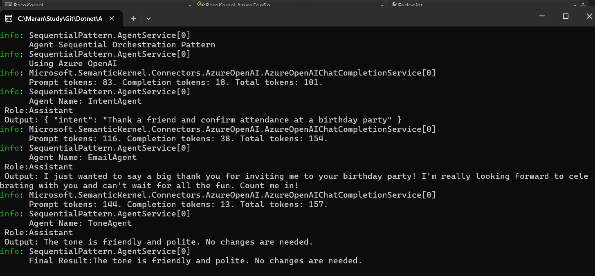
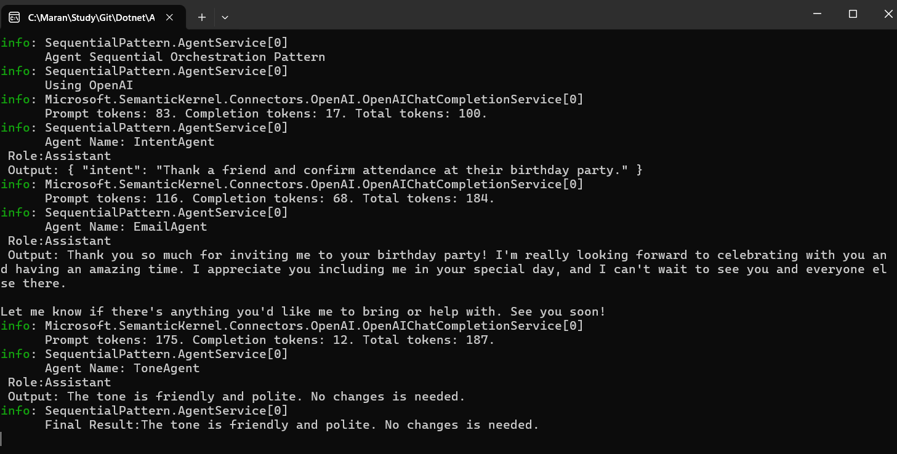

# Semantic Kernel Agent Orchestration Pattern - Sequential Pattern

This project demonstrates various agent orchestration patterns using Microsoft Semantic Kernel with both Azure OpenAI and OpenAI services.

## Project Structure

- **BaseKernel**: Shared library containing kernel factory and configuration
- **SequentialPattern**: Implementation of sequential agent orchestration pattern

## Features

- **Multi-Agent Orchestration**: Sequential pattern with Intent, Email Generation, and Tone Analysis agents
- **Dual AI Provider Support**: Both Azure OpenAI and OpenAI configurations
- **Dependency Injection**: Proper DI setup with logging
- **Configuration Management**: JSON configuration with user secrets support

## Sequential Pattern Example

The sequential pattern demonstrates a three-agent workflow:
1. **Intent Agent**: Extracts user intent from input
2. **Email Agent**: Generates email content based on intent
3. **Tone Agent**: Reviews and adjusts email tone

## Configuration

Update `appsettings.json` with your API keys:

```json
{
  "OpenAIConfig": {
    "DeploymentOrModelId": "gpt-4o",
    "ApiKey": "your-openai-key"
  },
  "AzureOpenAIConfig": {
    "Endpoint": "https://your-endpoint.openai.azure.com/",
    "ApiKey": "your-azure-key",
    "DeploymentOrModelId": "gpt-4o-mini"
  }
}
```

## Usage

### Using Azure OpenAI


### Using OpenAI


## Getting Started

1. Clone the repository
2. Configure your API keys in `appsettings.json` or user secrets
3. Run the SequentialPattern project

```bash
dotnet run --project SequentialPattern
```

## Dependencies

- .NET 9.0
- Microsoft.SemanticKernel 1.61.0
- Microsoft.SemanticKernel.Agents (Preview)
- Microsoft.Extensions.Hosting
- Microsoft.Extensions.Logging