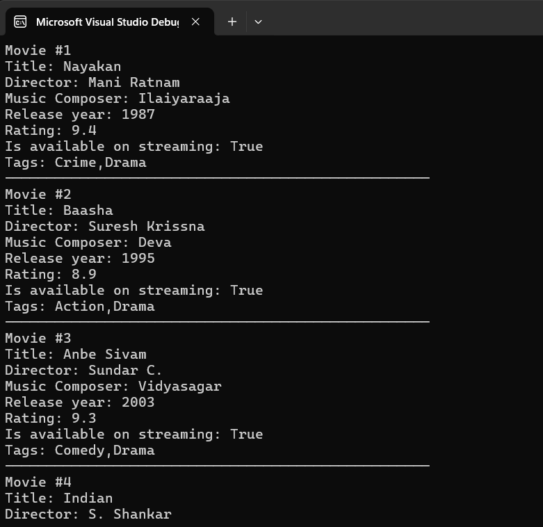

# Semantic Kernel Structured Output Demo

A .NET console application demonstrating how to use Microsoft Semantic Kernel to generate structured JSON responses from OpenAI or Azure OpenAI GPT models.

## Features

- **Structured Output**: Uses Semantic Kernel's built-in structured output capabilities to get JSON responses in a predefined format
- **Type-Safe Deserialization**: Automatically deserializes AI responses to strongly-typed C# objects
- **Configuration Management**: Supports multiple configuration sources (appsettings.json, environment variables, user secrets)
- **Movie Data Model**: Demonstrates structured output with a comprehensive movie information schema

## Project Structure

```
MoviesApp/
├── Program.cs          # Main application logic
├── Movie.cs           # Data models (Movie, MovieResult)
├── appsettings.json   # Configuration file
└── MoviesApp.csproj   # Project file
```

## Data Models

### Movie Class
```csharp
public class Movie
{
    public string Title { get; set; }
    public string Director { get; set; }
    public int ReleaseYear { get; set; }
    public double Rating { get; set; }
    public bool IsAvailableOnStreaming { get; set; }
    public List<string> Tags { get; set; }
    public string MusicComposer { get; set; }
}
```

### MovieResult Class
```csharp
public class MovieResult
{
    public List<Movie> Movies { get; set; } = new();
}
```

## Setup

### Prerequisites
- .NET 9.0 SDK
- OpenAI API Key

### Configuration

1. **appsettings.json**: Configure for OpenAI or Azure OpenAI
```json
{
  "OpenAI": {
    "ApiKey": "your-openai-api-key-here",
    "ModelId": "gpt-4o-mini"
  },
  "AzureOpenAI": {
    "ApiKey": "your-azure-openai-api-key-here",
    "Endpoint": "https://your-resource.openai.azure.com/",
    "DeploymentNameModelId": "gpt-4o-mini"
  },
  "LLM": "OpenAI" // Options: "OpenAI" or "AzureOpenAI"
}
```

2. **Environment Variable**: Set `OpenAI__ApiKey` for OpenAI

3. **User Secrets** (Recommended for development):
```bash
# For OpenAI
dotnet user-secrets set "OpenAI:ApiKey" "your-openai-api-key-here"

# For Azure OpenAI
dotnet user-secrets set "AzureOpenAI:ApiKey" "your-azure-openai-api-key-here"
dotnet user-secrets set "AzureOpenAI:Endpoint" "https://your-resource.openai.azure.com/"
```

### Required NuGet Packages

```xml
<PackageReference Include="Microsoft.Extensions.Configuration" Version="9.0.7" />
<PackageReference Include="Microsoft.SemanticKernel" Version="1.60.0" />
```

## Usage

### Basic Structured Output

```csharp
// Configure structured output for OpenAI
var executionSettings = new OpenAIPromptExecutionSettings
{
    ResponseFormat = typeof(MovieResult)
};

// Configure structured output for Azure OpenAI
var executionSettingsAzure = new AzureOpenAIPromptExecutionSettings
{
    ResponseFormat = typeof(MovieResult)
};

// Get structured response
var result = await kernel.InvokePromptAsync(
    "What are the top 10 tamil movies of all time?", 
    new(executionSettings)); // Use executionSettingsAzure for Azure OpenAI

// Deserialize to strongly-typed object
var movieResult = JsonSerializer.Deserialize<MovieResult>(result.ToString());
```

### Key Features Demonstrated

1. **Dual Provider Support**: Works with both OpenAI and Azure OpenAI
2. **Type-Safe Configuration**: Multiple configuration sources with fallback
3. **Structured AI Responses**: Guaranteed JSON format matching your C# classes
4. **Error-Free Deserialization**: No need to handle malformed JSON from AI
5. **Rich Data Models**: Complex nested objects with various data types
6. **Dynamic Provider Selection**: Runtime selection between OpenAI and Azure OpenAI

## Running the Application

```bash
cd MoviesApp
dotnet run
```

## Sample Output

```
Movie #1
Title: Baahubali 2: The Conclusion
Director: S. S. Rajamouli
Music Composer: M. M. Keeravani
Release year: 2017
Rating: 8.2
Is available on streaming: True
Tags: Epic,Action,Drama
---------------------------------------------------
```


## Benefits of Structured Output

- **Reliability**: Eliminates JSON parsing errors
- **Type Safety**: Compile-time checking of response structure
- **Consistency**: Guaranteed response format every time
- **Developer Experience**: IntelliSense support for AI response properties
- **Maintainability**: Easy to modify and extend data models

## Provider Support

### OpenAI
- Direct OpenAI API integration
- Uses `OpenAIPromptExecutionSettings`
- Compatible models: gpt-4o-mini, gpt-4o-2024-08-06, gpt-4o-2024-11-20

### Azure OpenAI
- Azure OpenAI Service integration
- Uses `AzureOpenAIPromptExecutionSettings`
- Requires deployment name and endpoint configuration
- Compatible with deployed models that support structured output

## Configuration Switching

Set the `LLM` property in appsettings.json to switch between providers:
- `"OpenAI"` - Uses OpenAI direct API
- `"AzureOpenAI"` - Uses Azure OpenAI Service

## License

This project is for educational purposes demonstrating Semantic Kernel structured output capabilities.