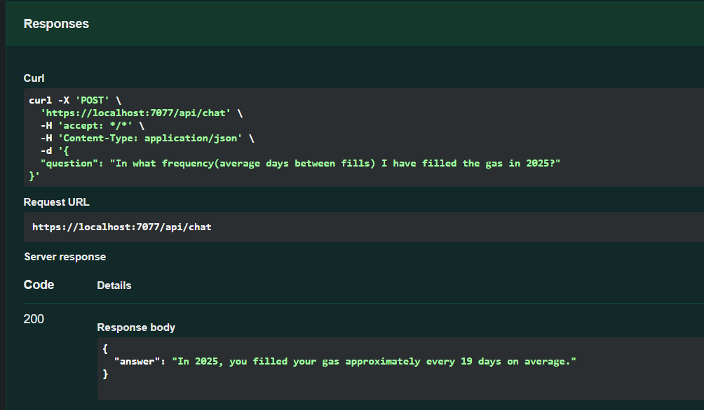
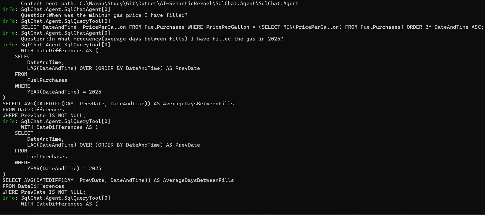

# SqlChat.Agent

A .NET 9 Web API that enables natural language querying of SQL databases using Microsoft Semantic Kernel and OpenAI. This intelligent agent converts user questions into SQL queries and executes them against a fuel purchases database.






## Features

- **Natural Language to SQL**: Convert plain English questions into SQL Server queries
- **AI-Powered**: Uses OpenAI GPT models through Microsoft Semantic Kernel
- **Secure Query Execution**: Only allows SELECT statements for data safety
- **RESTful API**: Simple HTTP endpoints for integration
- **Swagger Documentation**: Interactive API documentation
- **Structured Logging**: Comprehensive logging for debugging and monitoring

## Technology Stack

- **.NET 9**: Latest .NET framework
- **Microsoft Semantic Kernel**: AI orchestration framework
- **OpenAI API**: Large language model integration
- **Dapper**: Lightweight ORM for database operations
- **SQL Server**: Database backend
- **Swagger/OpenAPI**: API documentation

## Database Schema

The application queries the `FuelPurchases` table with the following columns:
- `Id` - Unique identifier
- `PricePerGallon` - Cost per gallon of fuel
- `GallonsPurchased` - Amount of fuel purchased
- `DateAndTime` - Purchase timestamp
- `TotalPrice` - Total cost of purchase
- `FuelStation` - Name of the fuel station

## Prerequisites

- .NET 9 SDK
- SQL Server (local or remote)
- OpenAI API key
- Visual Studio 2022 or VS Code

## Configuration

1. **Database Connection**: Update the connection string in `appsettings.json`:
```json
{
  "ConnectionStrings": {
    "SqlChatDatabase": "Your SQL Server connection string"
  }
}
```

2. **OpenAI Configuration**: Set your OpenAI credentials:
```json
{
  "OpenAI": {
    "DeploymentName": "gpt-4",
    "ApiKey": "your-openai-api-key"
  }
}
```

## Installation & Setup

1. **Clone the repository**:
```bash
git clone <repository-url>
cd SqlChat.Agent
```

2. **Restore dependencies**:
```bash
dotnet restore
```

3. **Configure settings**:
   - Update `appsettings.json` with your database and OpenAI credentials
   - Ensure your SQL Server has the `FuelPurchases` table

4. **Run the application**:
```bash
dotnet run
```

The API will be available at `https://localhost:7xxx` (port varies)

## API Endpoints

### Chat Endpoint
**POST** `/api/chat`

Send natural language questions about fuel purchases.

**Request Body**:
```json
{
  "question": "What was the average price per gallon last month?"
}
```

**Response**:
```json
{
  "answer": "The average price per gallon last month was $3.45."
}
```

### Example Questions

- "Show me all purchases from Shell stations"
- "What's the total amount spent on fuel this year?"
- "Which fuel station has the cheapest gas?"
- "How many gallons did I buy last week?"
- "Show me the most expensive fuel purchases"

## Project Structure

```
SqlChat.Agent/
├── Program.cs              # Application entry point and configuration
├── SqlChatAgent.cs         # Main chat agent implementation
├── ISqlChatAgent.cs        # Agent interface
├── SqlQueryTool.cs         # SQL execution tool for Semantic Kernel
├── SqlSystemPrompt.txt     # AI system prompt for SQL generation
├── appsettings.json        # Application configuration
└── SqlChat.Agent.csproj    # Project file
```

## Security Features

- **Query Restriction**: Only SELECT statements are allowed
- **Result Limiting**: Queries are limited to TOP 100 results
- **Input Validation**: SQL injection protection through parameterized queries
- **Connection Security**: Uses integrated security for database connections

## Development

### Running in Development
```bash
dotnet run --environment Development
```

### Swagger UI
Access the interactive API documentation at: `https://localhost:port/swagger`

### Logging
The application uses structured logging. Check console output for:
- User questions
- Generated SQL queries
- Execution results
- Error details

## Troubleshooting

### Common Issues

1. **Database Connection Failed**
   - Verify SQL Server is running
   - Check connection string format
   - Ensure database and table exist

2. **OpenAI API Errors**
   - Verify API key is correct
   - Check API quota and billing
   - Ensure model name is valid

3. **Query Execution Errors**
   - Check if FuelPurchases table exists
   - Verify column names match schema
   - Review SQL Server permissions

## Contributing

1. Fork the repository
2. Create a feature branch
3. Make your changes
4. Add tests if applicable
5. Submit a pull request

## License

This project is licensed under the MIT License.

## Support

For issues and questions:
- Check the troubleshooting section
- Review application logs
- Create an issue in the repository