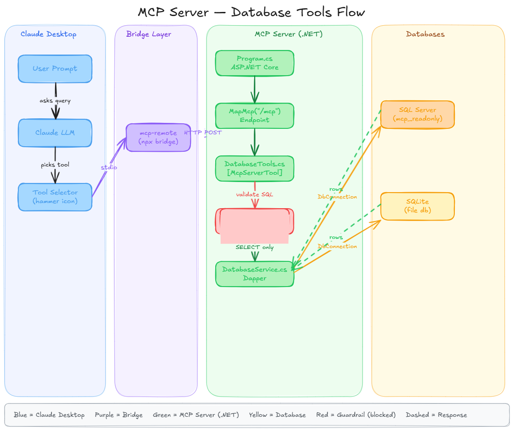
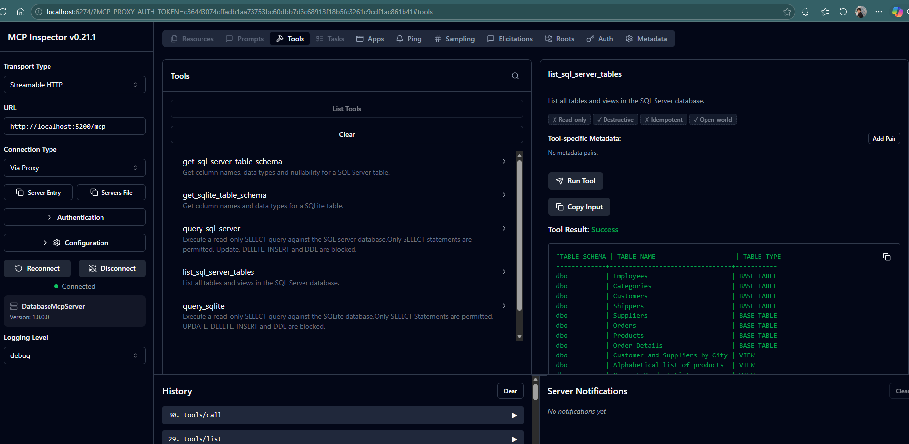
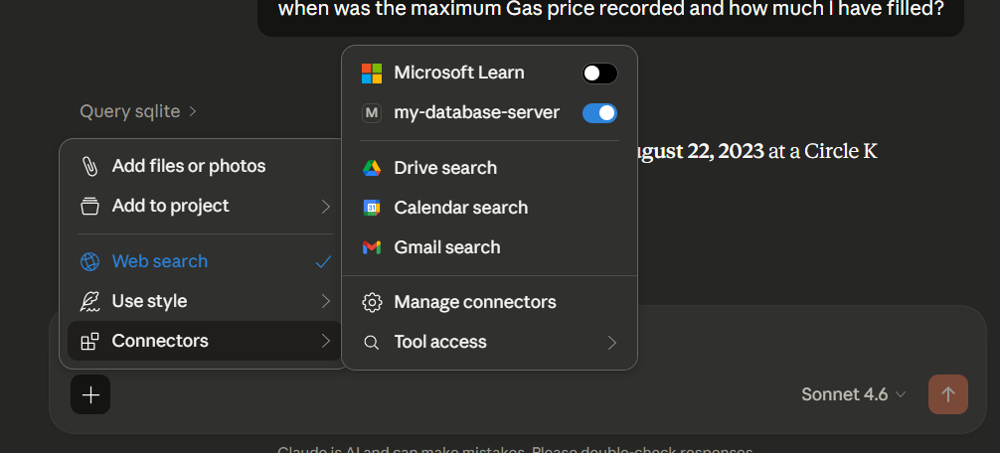
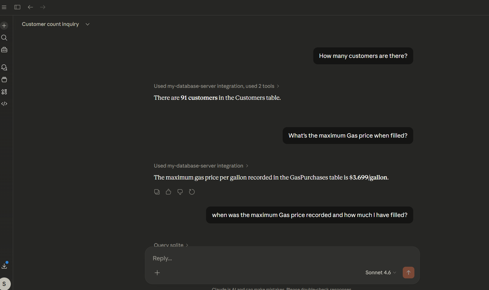
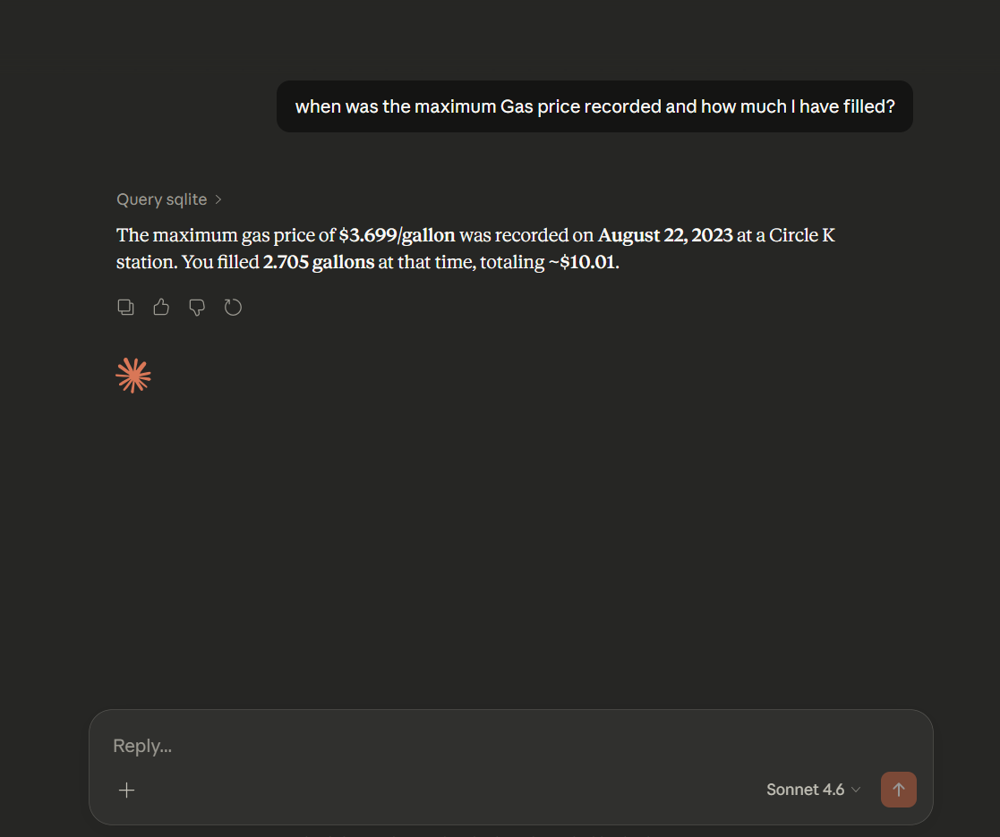
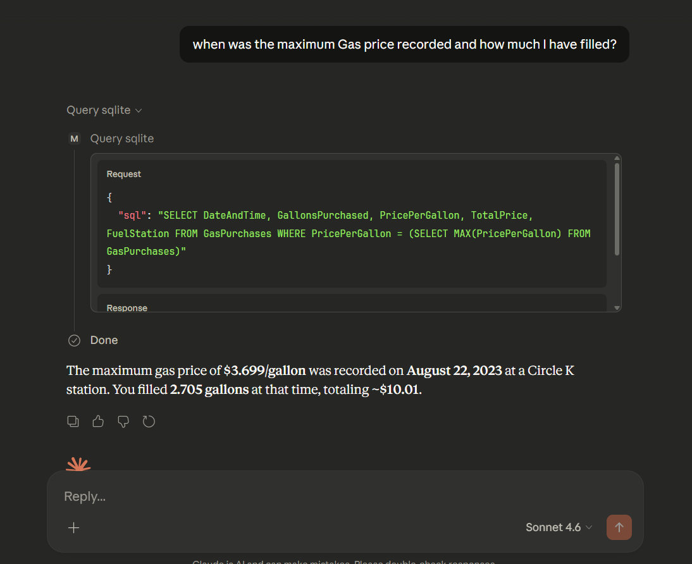

# McpServer with Database Tool connect to Sql Server and Sqlite database





### Database User and Guardrails
```sql
-- 1. Create login
CREATE LOGIN mcp_readonly WITH PASSWORD = 'StrongPassword123!';

-- 2. Create user in your database
USE MyAppDb;
CREATE USER mcp_readonly FOR LOGIN mcp_readonly;

-- 3. Grant SELECT only — nothing else
ALTER ROLE db_datareader ADD MEMBER mcp_readonly;

-- 4. Explicitly DENY write operations (double safety)
DENY INSERT, UPDATE, DELETE, EXECUTE ON SCHEMA::dbo TO mcp_readonly;
```

- Add the MCP Server to your Claude Desktop Config as shown below.

```json
  "my-database-server":{
      "command":"mcp-remote",
      "args":[
        "http://localhost:5200/mcp"
      ]
    }
```

Now test the MCP in Claude Desktop.









