# MCP Server with Streamable Http 
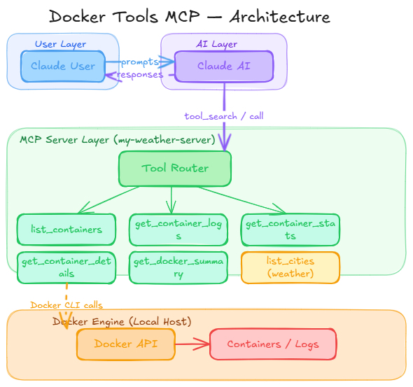

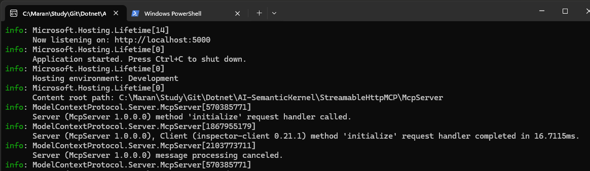

- Test using MCP Inspector

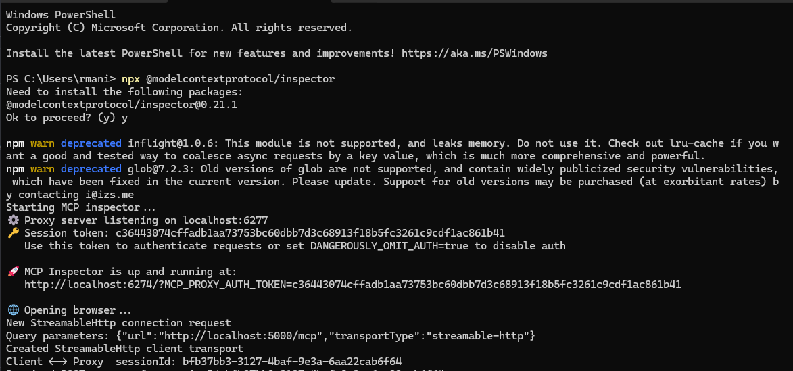

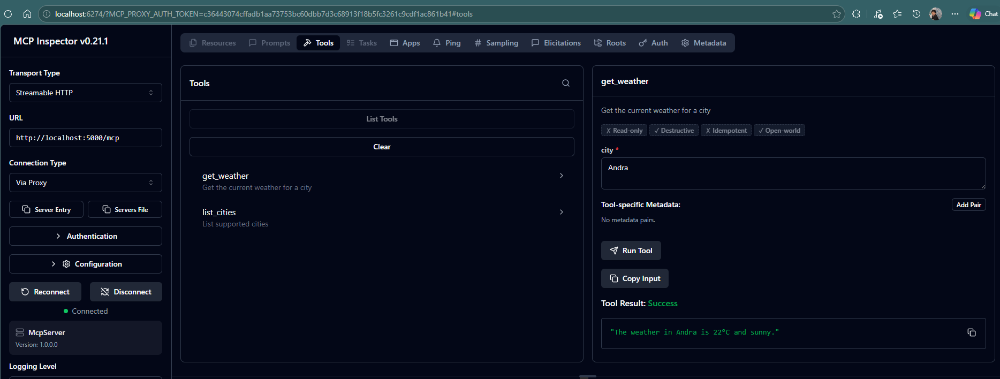

## Connect to Claude Desktop.
- Install the Claude Desktop.
- Go to settings --> Developer and update the claude config file.
- Add the below entry.

```json
{
   "mcpServers": {
    "my-weather-server": {
      "command": "mcp-remote",
      "args": [
        "http://localhost:5000/mcp"
      ]
    }
  },
  "preferences": {
    "coworkWebSearchEnabled": true,
    "coworkScheduledTasksEnabled": false,
    "ccdScheduledTasksEnabled": false,
    "sidebarMode": "chat"
  }
}
```

- Restart the Cluade Desktop. Ensure your MCP server application is running in the background.
- In the settings 

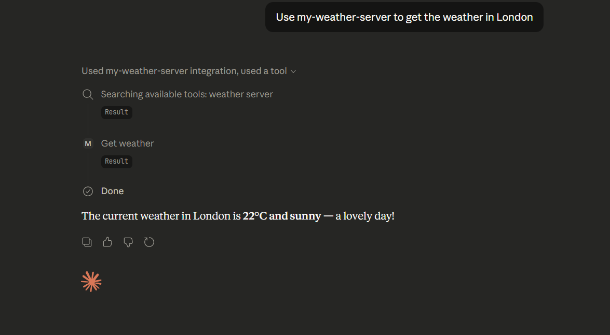

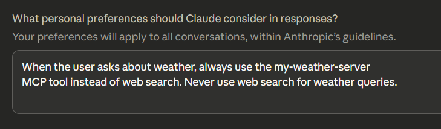

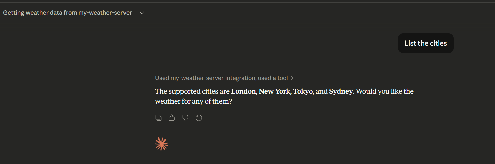

## Docker Desktop Tools

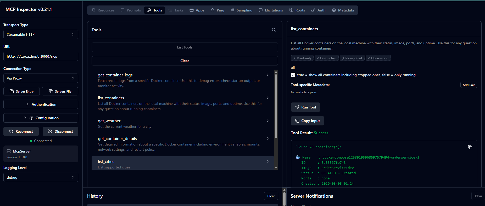

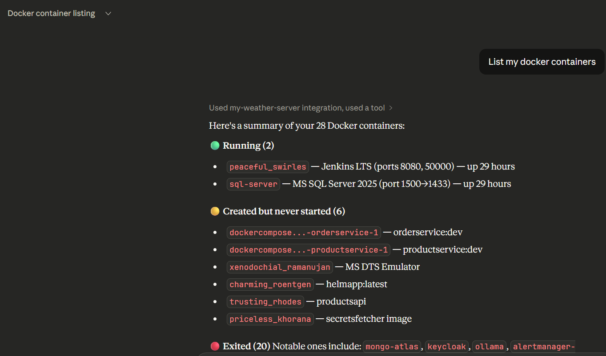

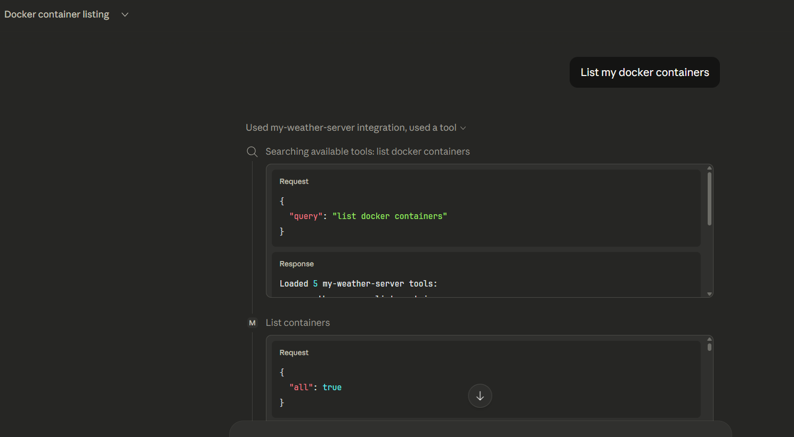

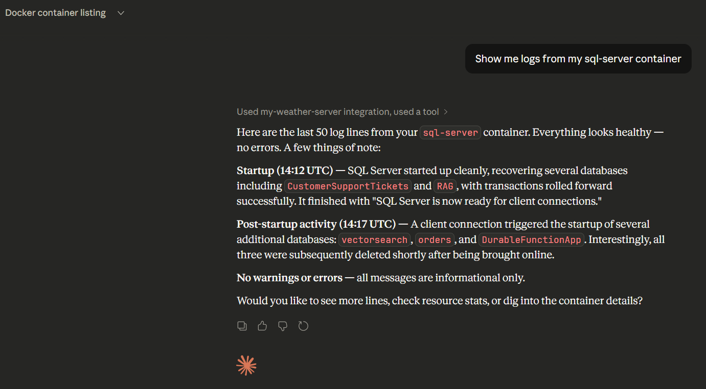


Here are some examples

"Give me a summary of all my Docker containers"
"Show me logs from my postgres container"
"Which containers are currently stopped?"
"Get CPU and memory usage for my api container"
"Show details of the redis container including its mounts"

## Consume in Microsoft Agent Framework 

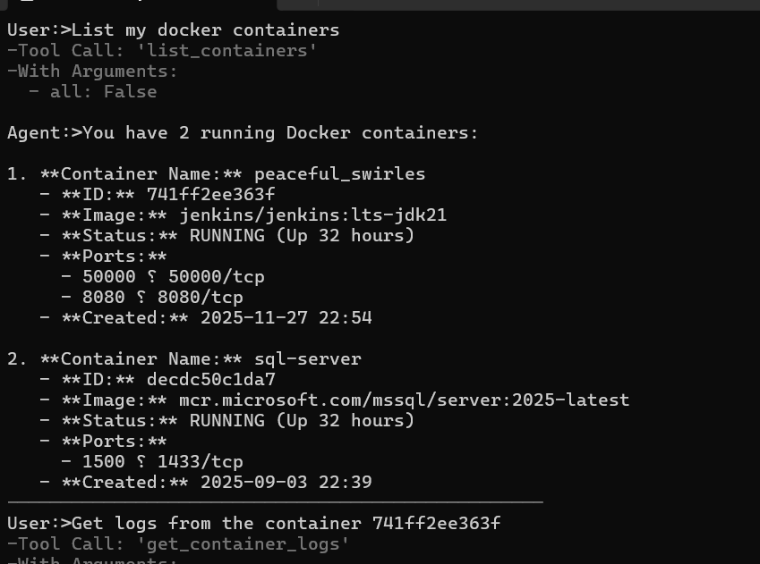

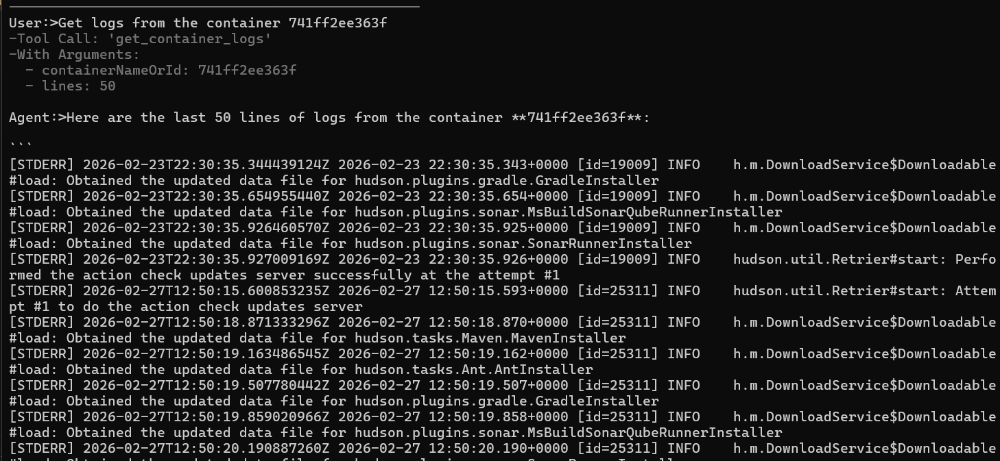

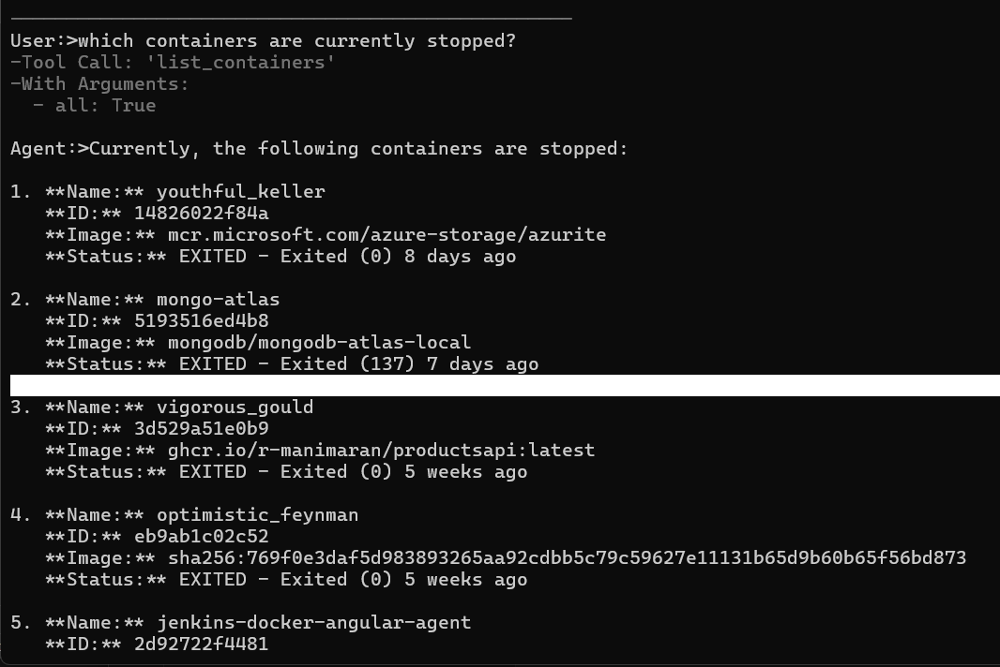

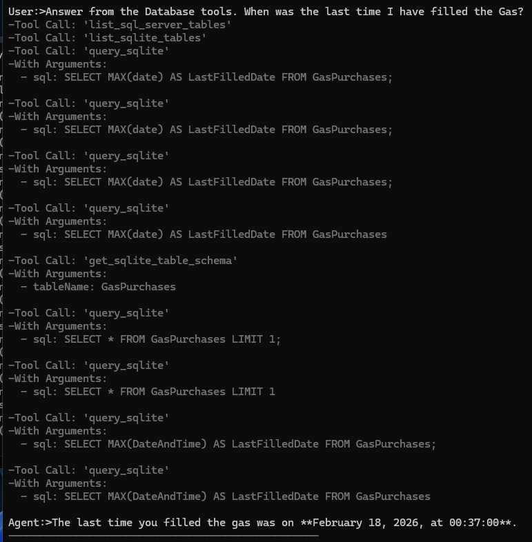

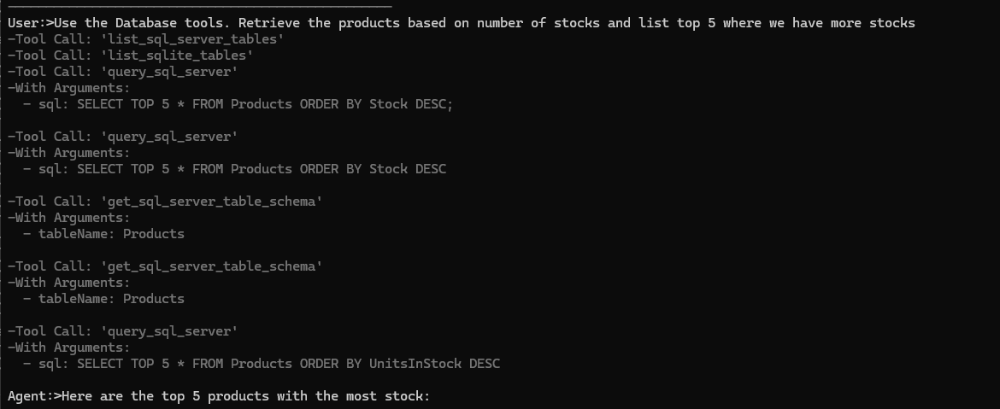

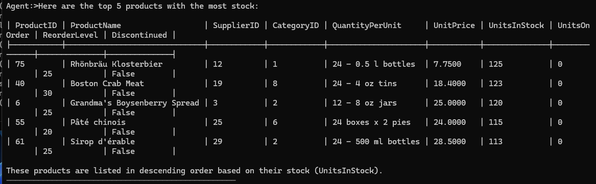